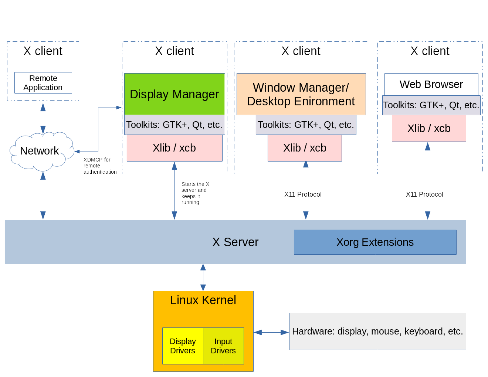
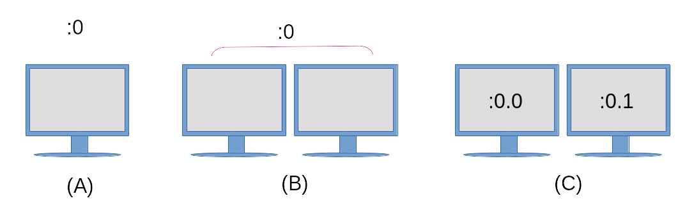

# LPIC-1: User Interfaces and Desktops

## Lesson 106.1: Install and configure X11

The X Window System is a software stack that is used to display text and graphics on a screen. The overall look and design of an X client is not dictated by the X Window System, but is instead handled by each individual X client, a window manager (e.g. Window Maker, Tab Window Manager), or a complete desktop environment such as KDE, GNOME, or Xfce. Desktop environments will be covered in a later lesson. This lesson will focus on the underlying architecture and common tools for the X Window System that an administrator would use to configure X.

The X Window System is cross-platform and runs on various operating systems such as Linux, the BSDs, Solaris and other Unix-like systems. There are also implementations available for Apple’s macOS and Microsoft Windows.

The primary version of the X protocol used in modern Linux distributions is X.org version 11, commonly written as X11. The X protocol is the communication mechanism between the X client and X server. The differences between the X client and X server will be discussed below.
```
Note
The X Window System’s predecessor was a window system called W and was a joint development effort between IBM, DEC and MIT. This software was born out of Project Athena in 1984. When the developers started work on a new display server, they chose the next letter in the English alphabet: “X”. The X Window System’s evolution is currently controlled by the MIT X Consortium.
```
### X Window System Architecture
The X Window System provides the mechanisms for drawing basic two dimensional shapes (and three dimensional shapes through extensions) on a display. It is divided into a client and a server, and in most installations where a graphical desktop is needed both of these components are on the same computer. The client component takes the form of an application, such as a terminal emulator, a game or a web browser. Each client application informs the X server about its window location and size on a computer screen. The client also handles what goes into that window, and the X server puts the requested drawing up on the screen. The X Window System also handles input from devices such as mice, keyboards, trackpads and more.

Basic Structure of an X Window System


The X Window System is network-capable and multiple X clients from different computers on a network can make drawing requests to a single remote X server. The reasoning behind this is so that an administrator or user can have access to a graphical application on a remote system that may not be available on their local system.

A key feature of the X Window System is that it is modular. Over the course of the X Window System’s existence newer features have been developed and added to its framework. These new components were only added as extensions to the X server, leaving the core X11 protocol intact. These extensions are contained within Xorg library files. Examples of Xorg libraries include: `libXrandr`, `libXcursor`, `libX11`, `libxkbfile` as well as several others, each providing extended functionality to the X server.

A display manager provides a graphical login to a system. This system can either be a local computer or a computer across a network. The display manager is launched after the computer boots and will start an X server session for the authenticated user. The display manager is also responsible for keeping the X server up and running. Example display managers include GDM, SDDM and LightDM.

Each instance of a running X server has a display name to identify it. The display name contains the following:
```
hostname:displaynumber.screennumber
```
The display name also instructs a graphical application where it should be rendered and on which host (if using a remote X connection).

The `hostname` refers to the name of the system that will display the application. If a hostname is missing from the display name, then the local host is assumed.

The `displaynumber` references the collection of “screens” that are in use, whether that is a single laptop screen or multiple screens on a workstation. Each running X server session is given a display number starting at `0`.

The default `screennumber` is `0`. This can be the case if only one physical screen or multiple physical screens are configured to work as one screen. When all screens in a multi-monitor setup are combined into one logical screen, application windows can be moved freely between the screens. In situations where each screen is configured to work independently of one another, each screen will house the application windows that open within them and the windows can not be moved from one screen to another. Each independent screen will have its own number assigned to it. If there is only one logical screen in use, then the dot and the screen number are omitted.

The display name of a running X session is stored in the `DISPLAY` environment variable:
```
$ echo $DISPLAY
:0
```
The output details the following:

1. The X server in use is on the local system, hence there is nothing printed to the left of the colon.
2. The current X server session is the first as indicated by the `0` immediately following the colon.
3. There is only one logical screen in use, so a screen number is not visible.

To further illustrate this concept, refer to the following diagram:

Example Display Configurations


(A)
- A single monitor, with a single display configuration and only one screen.

(B)
- Configured as a single display, with two physical monitors configured as one screen. Application windows can be moved freely between the two monitors.

(C)
- A single display configuration (as indicated by the `:0`) however each monitor is an independent screen. Both screens will still share the same input devices such as a keyboard and mouse, however an application opened on screen `:0.0` can not be moved to screen `:0.1` and vice versa.

To start an application on a specific screen, assign the screen number to the `DISPLAY` environment variable prior to launching the application:
```
$ DISPLAY=:0.1 firefox &
```
This command would start the Firefox web browser on the screen to the right in the diagram above. Some toolkits also provide command line options to instruct an application to run on a specified screen. See `--screen` and `--display` in the `gtk-options(7)` man page for an example.

### X Server Configuration
Traditionally, the primary configuration file that is used to configure an X server is the /etc/X11/xorg.conf file. On modern Linux distributions, the X server will configure itself at runtime when the X server is started and so no xorg.conf file may exist.

The xorg.conf file is divided up into separate stanzas called sections. Each section begins with the term Section and following this term is the section name which refers to a component’s configuration. Each Section is terminated by a corresponding EndSection. The typical xorg.conf file contains the following sections:

InputDevice
Used to configure a specific model of keyboard or mouse.

InputClass
In modern Linux distributions this section is typically found in a separate configuration file located under /etc/X11/xorg.conf.d/. The InputClass is used to configure a class of hardware devices such as keyboards and mice rather than a specific piece of hardware. Below is an example /etc/X11/xorg.conf.d/00-keyboard.conf file:

Section "InputClass"
        Identifier "system-keyboard"
        MatchIsKeyboard "on"
        Option "XkbLayout" "us"
        Option "XkbModel" "pc105"
EndSection
The option for XkbLayout determines the layout of the keys on a keyboard, such as Dvorak, left or right handed, QWERTY and language. The option for XkbModel is used to define the type of keyboard in use. A table of models, layouts and their descriptions can be found within xkeyboard-config(7). The files associated with keyboard layouts can be found within /usr/share/X11/xkb. An example Greek Polytonic keyboard layout on a Chromebook computer would look like the following:

Section "InputClass"
        Identifier "system-keyboard"
        MatchIsKeyboard "on"
        Option "XkbLayout" "gr(polytonic)"
        Option "XkbModel" "chromebook"
EndSection
Alternatively, a keyboard’s layout can be modified during a running X session with the setxkbmap command. Here is an example of this command setting up the Greek Polytonic layout on a Chromebook computer:

$ setxkbmap -model chromebook -layout "gr(polytonic)"
This setting will only last as long as the X session in use. To make such changes permanent, modify the /etc/X11/xorg.conf.d/00-keyboard.conf file to include the settings required.

Note
The setxkbmap command makes use of the X Keyboard Extension (XKB). This is an example of the additive functionality of the X Window System through its use of extensions.

Modern Linux distributions provide the localectl command via systemd which can also be used to modify a keyboard layout and will automatically create the /etc/X11/xorg.conf.d/00-keyboard.conf configuration file. Once more, here is an example setting up a Greek Polytonic keyboard on a Chromebook, this time using the localectl command:

$ localectl --no-convert set-x11-keymap "gr(polytonic)" chromebook
The --no-convert option is used here to prevent localectl from modifying the host’s console keymap.

Monitor
The Monitor section describes the physical monitor that is used and where it is connected. Here is an example configuration showing a hardware monitor connected to the second display port and is used as the primary monitor.

Section "Monitor"
        Identifier  "DP2"
        Option      "Primary" "true"
EndSection
Device
The Device section describes the physical video card that is used. The section will also contain the kernel module used as the driver for the video card, along with its physical location on the motherboard.

Section "Device"
        Identifier  "Device0"
        Driver      "i915"
        BusID       "PCI:0:2:0"
EndSection
Screen
The Screen section ties the Monitor and Device sections together. An example Screen section could look like the following;

Section "Screen"
        Identifier "Screen0"
        Device     "Device0"
        Monitor    "DP2"
EndSection
ServerLayout
The ServerLayout section groups all of the sections such as mouse, keyboard and screens into one X Window System interface.

Section "ServerLayout"
	Identifier   "Layout-1"
	Screen       "Screen0" 0 0
	InputDevice  "mouse1"  "CorePointer"
	InputDevice  "system-keyboard"  "CoreKeyboard"
EndSection
Note
Not all sections may be found within a configuration file. In instances where a section is missing, default values are provided by the running X server instance instead.

User-specified configuration files also reside in /etc/X11/xorg.conf.d/. Configuration files provided by the distribution are located in /usr/share/X11/xorg.conf.d/. The configuration files located within /etc/X11/xorg.conf.d/ are parsed prior to the /etc/X11/xorg.conf file if it exists on the system.

The xdpyinfo command is used on a computer to display information about a running X server instance. Below is sample output from the command:

$ xdpyinfo
name of display:    :0
version number:    11.0
vendor string:    The X.Org Foundation
vendor release number:    12004000
X.Org version: 1.20.4
maximum request size:  16777212 bytes
motion buffer size:  256
bitmap unit, bit order, padding:    32, LSBFirst, 32
image byte order:    LSBFirst
number of supported pixmap formats:    7
supported pixmap formats:
    depth 1, bits_per_pixel 1, scanline_pad 32
    depth 4, bits_per_pixel 8, scanline_pad 32
    depth 8, bits_per_pixel 8, scanline_pad 32
    depth 15, bits_per_pixel 16, scanline_pad 32
    depth 16, bits_per_pixel 16, scanline_pad 32
    depth 24, bits_per_pixel 32, scanline_pad 32
    depth 32, bits_per_pixel 32, scanline_pad 32
keycode range:    minimum 8, maximum 255
focus:  None
number of extensions:    25
    BIG-REQUESTS
    Composite
    DAMAGE
    DOUBLE-BUFFER
    DRI3
    GLX
    Generic Event Extension
    MIT-SCREEN-SAVER
    MIT-SHM
    Present
    RANDR
    RECORD
    RENDER
    SECURITY
    SHAPE
    SYNC
    X-Resource
    XC-MISC
    XFIXES
    XFree86-VidModeExtension
    XINERAMA
    XInputExtension
    XKEYBOARD
    XTEST
    XVideo
default screen number:    0
number of screens:    1

screen #0:
  dimensions:    3840x1080 pixels (1016x286 millimeters)
  resolution:    96x96 dots per inch
  depths (7):    24, 1, 4, 8, 15, 16, 32
  root window id:    0x39e
  depth of root window:    24 planes
  number of colormaps:    minimum 1, maximum 1
  default colormap:    0x25
  default number of colormap cells:    256
  preallocated pixels:    black 0, white 16777215
  options:    backing-store WHEN MAPPED, save-unders NO
  largest cursor:    3840x1080
  current input event mask:    0xda0033
    KeyPressMask             KeyReleaseMask           EnterWindowMask
    LeaveWindowMask          StructureNotifyMask      SubstructureNotifyMask
    SubstructureRedirectMask PropertyChangeMask       ColormapChangeMask
  number of visuals:    270
...
The more relevant portions of the output are in bold, such as the name of the display (which is the same as the contents of the DISPLAY environment variable), the versioning information of the X server in use, the number and listing of Xorg extensions in use, and further information about the screen itself.

Creating a Basic Xorg Configuration File
Even though X will create its configuration after system startup on modern Linux installations, an xorg.conf file can still be used. To generate a permanent /etc/X11/xorg.conf file, run the following command:

$ sudo Xorg -configure
Note
If there is already an X session running, you will need to specify a different DISPLAY in your command, for example:

$ sudo Xorg :1 -configure
On some Linux distributions, the X command can be used in place of Xorg, as X is a symbolic link to Xorg.

An xorg.conf.new file will be created in your current working directory. The contents of this file are derived from what the X server has found to be available in hardware and drivers on the local system. To use this file, it will need to be moved to the /etc/X11/ directory and renamed to xorg.conf:

$ sudo mv xorg.conf.new /etc/X11/xorg.conf
Note
The following manual pages provide further information on components of the X Window System: xorg.conf(5), Xserver(1), X(1) and Xorg(1).

Wayland
Wayland is the newer display protocol designed to replace the X Window System. Many modern Linux distributions are using it as their default display server. It is meant to be lighter on system resources and have a smaller installation footprint than X. The project began in 2010 and is still undergoing active development, including work from active and former X.org developers.

Unlike the X Window System, there is no server instance that runs between the client and kernel. Instead, a client window works with its own code or that of a toolkit (such as Gtk+ or Qt) to provide the rendering. In order to do the rendering, a request is made to the Linux kernel via the Wayland protocol. The kernel forwards the request via the Wayland protocol to the Wayland compositor, which handles device input, window management and composition. The compositor is the part of the system that combines the rendered elements into visual output on the screen.

Most modern toolkits such Gtk+ 3 and Qt 5 have been updated to allow for rendering to either an X Window System or a computer running Wayland. Not all standalone applications have been written to support rendering in Wayland as of yet. For applications and frameworks that are still targeting the X Window System to run, the application can run within XWayland. The XWayland system is a separate X server that runs within a Wayland client and thus renders a client window’s contents within a standalone X server instance.

Just as the X Window System uses a DISPLAY environment variable to keep track of screens in use, the Wayland protocol uses a WAYLAND_DISPLAY environment variable. Below is sample output from a system running a Wayland display:

$ echo $WAYLAND_DISPLAY
wayland-0
This environment variable is not available on systems running X.

___
This documentation is provided by the Linux Professional Institute

[Attribution-NonCommercial-NoDerivatives 4.0 International (CC BY-NC-ND 4.0)](https://creativecommons.org/licenses/by-nc-nd/4.0/)

[Get the Full PDF](https://learning.lpi.org/en/learning-materials/102-500/)