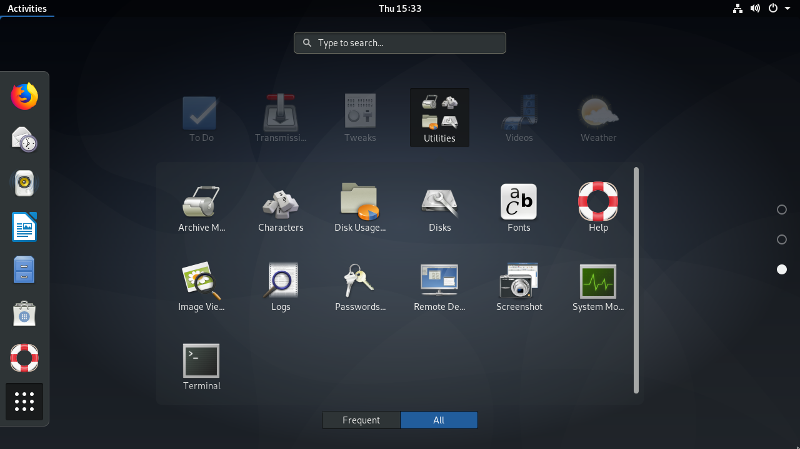

# LPIC-1.106: User Interfaces and Desktops

## Lesson 106.2: Graphical Desktops

Linux based operating systems are known for their advanced command line interface, but it can be intimidating for non-technical users. Intending to make computer usage more intuitive, the combination of high resolution displays with pointing devices gave birth to picture driven user interfaces. Whilst the command line interface requires prior knowledge about program names and their configuration options, with a graphical user interface (GUI) program functionality can be triggered by pointing to familiar visual elements, making the learning curve less steep. Furthermore, the graphical interface is best suited for multimedia and other visually oriented activities.

Indeed, the graphical user interface is almost a synonym to computer interface and most Linux distributions come with the graphical interface installed by default. There is not, however, a single monolithic program accountable for the full featured graphical desktops available in Linux systems. Instead, each graphical desktop is in fact a large collection of programs and their dependencies, varying from distribution’s choices to the user’s personal taste.

`X Window System`
In Linux and other Unix-like operating systems where it’s employed, the X Window System (also known as X11 or just X) provides the low-level resources related to the graphical interface rendering and the user interaction with it, such as:

- The handling of the input events, like mouse movements or keystrokes.
- The ability to cut, copy and paste text content between separate applications.
- The programming interface other programs resort to draw the graphic elements.

Although the X Window System is in charge of controlling the graphic display (the video driver itself is part of X), it is not intended to draw complex visual elements on its own. Shapes, colors, shades and any other visual effects are generated by the application running on top of X. This approach gives applications a lot of room to create customized interfaces, but it can also lead to development overhead that is beyond the application scope and to inconsistencies in appearance and behaviour when compared to other program interfaces.

From the developer’s perspective, the introduction of the desktop environment facilitates the GUI programming bound to the underlying application development, whereas from the user’s perspective it gives a consistent experience among distinct applications. Desktop environments bring together programming interfaces, libraries and supporting programs that cooperate to deliver traditional but still evolving design concepts.

### Desktop Environment
The traditional desktop computer GUI consists of various windows — the term window is used here to refer to any autonomous screen area — associated with running processes. As the X Window System alone offers only basic interactive features, the full user experience depends on the components provided by the desktop environment.

Probably the most important component of a desktop environment, the window manager controls window placement and decorations. It is the window manager that adds the title bar to the window, the control buttons — generally associated with the minimize, maximize and close actions — and manages the switching between open windows.
```
Note
The basic concepts found in graphic interfaces of desktop computers came from ideas taken from actual office workspaces. Metaphorically speaking, the computer screen is the desktop, where objects like documents and folders are placed. An application window with the content of a document mimics physical acts like filling in a form or painting a picture. As actual desktops, computer desktops also have software accessories like notepads, clocks, calendars, etc., most of them based on their “real” counterparts.
```
All desktop environments provide a window manager that matches the look and feel of its widget toolkit. Widgets are informative or interactive visual elements, like buttons or text input fields, distributed inside the application window. The standard desktop components — like the application launcher, taskbar, etc. — and the window manager itself rely on such widget toolkits to assemble their interfaces.

Software libraries, like GTK+ and Qt, provide widgets that programmers can use to build elaborate graphical interfaces for their applications. Historically, applications developed with GTK+ didn’t look like applications made with Qt and vice-versa, but the better theme support of today’s desktop environments make the distinction less obvious.

Overall, GTK+ and Qt offer the same features regarding widgets. Simple interactive elements can be indistinguishable, whereas composite widgets — such as the dialog window used by applications to open or save files — can, however, look quite different. Nonetheless, applications built with distinct toolkits can run simultaneously, regardless of the widget toolkit used by the other desktop components.

In addition to the basic desktop components, which could be considered individual programs on their own, desktop environments pursue the desktop metaphor by providing a minimal set of accessory applications developed under the same design guidelines. Variations of the following applications are commonly provided by all major desktop environments:

System related applications
- Terminal emulator, file manager, package installation manager, system configuration tools.

Communication and Internet
- Contacts manager, email client, web browser.

Office applications
- Calendar, calculator, text editor.

Desktop environments may include many other services and applications: the login screen greeter, session manager, inter-process communication, keyring agent, etc. They also incorporate features provided by third-party system services, such as PulseAudio for sound and CUPS for printing. These features do not need the graphical environment to work, but the desktop environment provides graphical frontends to facilitate the configuration and operation of such resources.

### Popular Desktop Environments
Many proprietary operating systems support only a single official desktop environment, which is tied to their particular release and it is not supposed to be changed. Unlike them, Linux-based operating systems support different desktop environment options that can be used in conjunction with X. Each desktop environment has its own features, but they usually share some common design concepts:

- An application launcher listing the builtin and third-party applications available in the system.
- Rules defining the default applications associated to file types and protocols.
- Configuration tools to customize the appearance and behaviour of the desktop environment.

Gnome is one of the most popular desktop environments, being the first choice in distributions like Fedora, Debian, Ubuntu, SUSE Linux Enterprise, Red Hat Enterprise Linux, CentOS, etc. In its version 3, Gnome brought major changes in its look and structure, moving away from the desktop metaphor and introducing the Gnome Shell as its new interface.


Figure 1. Gnome Shell Activities

The general purpose full-screen launcher Gnome Shell Activities replaced the traditional application launcher and taskbar. However, it is still possible to use Gnome 3 with the old look by choosing the Gnome Classic option in the login screen.

KDE is a large ecosystem of applications and development platform. Its latest desktop environment version, KDE Plasma, is used by default in openSUSE, Mageia, Kubuntu, etc. The employment of the Qt library is KDE’s striking feature, giving it its unmistakable appearance and a plethora of original applications. KDE even provides a configuration tool to ensure visual cohesion with GTK+ applications.


Figure 2. KDE GTK Settings

Xfce is a desktop environment that aims to be aesthetically pleasing while not consuming a lot of machine resources. Its structure is highly modularized, allowing a user to activate and to deactivate components according to the user’s needs and preferences.


Figure 3. The Xfce desktop

There are many other desktop environments for Linux, usually provided by alternative distribution spins. The Linux Mint distribution, for example, provides two original desktop environments: Cinnamon (a fork of Gnome 3) and MATE (a fork of Gnome 2). LXDE is a desktop environment tailored to low resource consumption, which makes it a good choice for installation on older equipment or single board computers. While not offering all the features of heavier desktop environments, LXDE offers all the basic features expected from a modern graphical user interface.
```
Tip
Keyboard shortcuts play an important role in the interaction with the desktop environment. Some keyboard shortcuts — such as Alt+Tab to switch between windows or Ctrl+c to copy text — are universal across desktop environments, but each desktop environment has its own keyboard shortcuts too. Keyboard shortcuts are found in the keyboard configuration tool provided by the desktop environment, where shortcuts can be added or modified.
```
### Desktop Interoperability
The diversity of desktop environments in Linux-based operating systems imposes a challenge: how to make them work correctly with third-party graphical applications or system services without having to implement specific support for each of them. Shared methods and specifications across desktop environments greatly improve user experience and settles many development issues, as graphical applications must interact with the current desktop environment regardless of the desktop environment they originally were designed for. In addition to that, it is important to keep general desktop settings if the user eventually changes their desktop environment choice.

A large body of specifications for desktop interoperability is maintained by the freedesktop.org organization. The adoption of the full specification is not mandatory, but many of them are widely used:

Directories locations
- Where the personal settings and other user-specific files are located.

Desktop entries
- Command line applications can run in the desktop environment through any terminal emulator, but it would be too confusing to make all of them available in the application launcher. Desktop entries are text files ending with .desktop which are used by the desktop environment to gather information about the available desktop applications and how to use them.

Application autostart
- Desktop entries indicating the application that should start automatically after the user has logged in.

Drag and drop
- How applications should handle drag and drop events.

Trash can
- The common location of files deleted by the file manager, as well as the methods to store and remove files from there.

Icon themes
- The common format for interchangeable icon libraries.

The ease of use provided by desktop environments has a downside compared to text interfaces such as the shell: the ability to provide remote access. While a remote machine command-line shell environment can be easily accessed with tools such as `ssh`, remote access to graphical environments requires different methods and may not achieve satisfactory performance on slower connections.

### Non-Local Access
The X Window Systems adopts a design based on autonomous displays, where the same X display manager can control more than one graphical desktop session at the same time. In essence, a display is analogous to a text terminal: both refer to a machine or software application used as an entry point to establish an independent operating system session. Although the most common setup involves a singular graphical session running in the local machine, other less conventional setups are also possible:

- Switch between active graphical desktop sessions in the same machine.
- More than one set of display devices (e.g. screen, keyboard, mouse) connected to the same machine, each one controlling its own graphical desktop session.
- Remote graphical desktop sessions, where the graphical interface is sent through the network to a remote display.

Remote desktop sessions are supported natively by X, which employs the X Display Manager Control Protocol (XDMCP) to communicate with remote displays. Due to its high bandwidth usage, XDMCP is rarely used through the internet or in low-speed LANs. Security issues are also a concern with XDMCP: the local display communicates with a privileged remote X display manager to execute remote procedures, so an eventual vulnerability could make it possible to execute arbitrary privileged commands on the remote machine.

Furthermore, XDMCP requires X instances running on both ends of the connection, which can make it unfeasible if the X Windows System is not available for all the machines involved. In practice, other more efficient and less invasive methods are used to establish remote graphical desktop sessions.

Virtual Network Computing (VNC) is a platform-independent tool to view and control remote desktop environments using the Remote Frame Buffer protocol (RFB). Through it, events produced by the local keyboard and mouse are transmitted to the remote desktop, which in turn sends back any screen updates to be displayed locally. It is possible to run many VNC servers in the same machine, but each VNC server needs an exclusive TCP port in the network interface accepting incoming session requests. By convention, the first VNC server should use TCP port 5900, the second should use 5901, and so on.

The VNC server does not need special privileges to run. An ordinary user can, for example, log in to their remote account and start their own VNC server from there. Then, in the local machine, any VNC client application can be used to access the remote desktop (assuming the corresponding network ports are reachable). The ~/.vnc/xstartup file is a shell script executed by the VNC server when it starts and can be used to define which desktop environment the VNC server will make available for the VNC client. It is important to note that VNC does not provide modern encryption and authentication methods natively, so it should be used in conjunction with a third-party application that provides such features. Methods involving VPN and SSH tunnels are often used to secure VNC connections.

The Remote Desktop Protocol (RDP) is mainly used to remotely access the desktop of a Microsoft Windows operating system through the TCP 3389 network port. Although it uses Microsoft’s proprietary RDP protocol, the client implementation used in Linux systems are open-source programs licensed under the GNU General Public License (GPL) and has no legal restrictions on use.

Simple Protocol for Independent Computing Environments (Spice) comprises a suite of tools aimed at accessing the desktop environment of virtualised systems, either in the local machine or in a remote location. In addition to that, the Spice protocol offers native features to integrate the local and remote systems, like the ability to access local devices (for example, the sound speakers and the connected USB devices) from the remote machine and file sharing between the two systems.

There are specific client commands to connect to each one of these remote desktop protocols, but the Remmina remote desktop client provides an integrated graphical interface that facilitates the connection process, optionally storing the connection settings for later use. Remmina has plugins for each individual protocol and there are plugins for XDMCP, VNC, RDP and Spice. The choice of the right tool depends on the operating systems involved, the quality of the network connection and what features of the remote desktop environment should be available.


___
This documentation is provided by the Linux Professional Institute

[Attribution-NonCommercial-NoDerivatives 4.0 International (CC BY-NC-ND 4.0)](https://creativecommons.org/licenses/by-nc-nd/4.0/)

[Get the Full PDF](https://learning.lpi.org/en/learning-materials/102-500/)