# Web Development Essentials - Topic 2: HTML Document Markup

## Lesson 2-1 HTML Document Anatomy

HTML (HyperText Markup Language) is a markup language that tells web browsers how to structure and display web pages. The current version is 5.0, which was released in 2012. The HTML syntax is defined by the World Wide Web Consortium (W3C).

HTML is a fundamental skill in web development, as it defines the structure and a good deal of the appearance of a website. If you want a career in web development, HTML is definitely a good starting point.

### Anatomy of an HTML Document
A basic HTML page has the following structure:

```
<!DOCTYPE html>
<html>
  <head>
    <title>My HTML Page</title>
    <!-- This is the Document Header -->
  </head>

  <body>
    <!-- This is the Document Body -->
  </body>
</html>
```

Now, let’s analyze it in detail.

### HTML Tags
HTML uses elements and tags to describe and format content. Tags consist of angle brackets around a tag name, for example `<title>`. The tag name is not case-sensitive, although the World Wide Web Consortium (W3C) recommends using lowercase letters in current versions of HTML. These HTML tags are used to build HTML elements. The tag `<title>` is an example for an opening tag of an HTML element that defines the title of an HTML document. However, an element has two further components. A full `<title>` element looking like this:

```
<title>My HTML Page</title>
```

Here, `My HTML Page` serves as the element content, while `</title>` serves as the closing tag that declares that this element is complete.

```
Note
Not all HTML elements need to be closed; in such cases, we speak of empty elements, self-closing elements, or void elements.
```

Here are the other HTML elements from the previous example:

`<html>`
Encloses the entire HTML document. This contains all the tags that make up the page. It also indicates that the content of this file is in HTML language. Its corresponding closing tag is `</html>`.

`<head>`
A container for all meta information regarding the page. The corresponding closing tag of this element is `</head>`.

`<body>`
A container for the page content and its structural representation. Its corresponding closing tag is `</body>`.

The `<html>`, `<head>`, `<body>` and `<title>` tags are so-called skeleton tags, which provide the basic structure of an HTML document. In particular, they tell the web browser that it is reading an HTML page.

```
Note
Of these HTML elements, the only one that is required for an HTML document to be validated is the <title> tag.
```

As you can see, each HTML page is a well-structured document and could even be referred to as a tree, where the `<html>` element represents the document root and the `<head>` and `<body>` elements are the first branches. The example shows that it is possible to nest elements: For example, the `<title>` element is nested inside the `<head>` element, which is in turn nested inside the `<html>` element.

To ensure that your HTML code is readable and maintainable, make sure that all HTML elements are closed properly and in order. Web browsers may still render your web site as expected, but incorrect nesting of elements and their tags is an error-prone practice.

Finally, a special mention goes to the doctype declaration at the very top of the example document structure. `<!DOCTYPE>` is not an HTML tag, but an instruction for the web browser that specifies the HTML version used in the document. In the basic HTML document structure shown earlier, `<!DOCTYPE html>` was used, specifying that HTML5 is used in this document.

### HTML Comments
When creating an HTML page, it is good practice to insert comments into the code to improve its readability and describe the purpose of larger code blocks. A comment is inserted between the `<!--` and `-->` tags, as shown in the following example:

```
<!-- This is a comment. -->

<!--
    This is a
    multiline
    comment.
-->
```

The example demonstrates that HTML comments can be placed in a single line, but may also span over multiple lines. In any case, the result is that the text between `<!--` and `-->` is ignored by the web browser and therefore not displayed in the HTML page. Based on these considerations, you can deduce that the basic HTML page shown in the previous section does not display any text, because the lines `<!-- This is the Document Header -->` and `<!-- This is the Document Body -->` are just two comments.

```
Warning
Comments cannot be nested.
```

### HTML Attributes
HTML tags may include one or more attributes to specify details of the HTML element. A simple tag with two attributes has the following form:

```
<tag attribute-a="value-a" attribute-b="value-b">
```

Attributes must always be set on the opening tag.

An attribute consists of a name, which indicates the property that should be set, an equal sign, and the desired value within quotes. Both single quotes and double quotes are acceptable, but it is recommended to use of single quotes or double quotes consistently throughout a project. It is important not to mix single and double quotes for a single attribute value, as the web browser will not recognize mixed quotes as one unit.

```
Note
You can include one type of quotation marks within the other type without any problems. For example, if you need to use ' in an attribute value, you can wrap that value within ". However, if you want to use the same type of quotation mark inside the value as you are using to wrap the value, you need to use &quot; for " and &apos; for '.
```

The attributes can be categorized into core attributes and specific attributes as explained in the following sections.

### Core Attributes
Core attributes are attributes that can be used on any HTML element. They include:

`title`
= Describes the content of the element. Its value is often displayed as a tooltip that is shown when the user moves their cursor over the element.

`id`
- Associates a unique identifier with an element. This identifier must be unique within the document, and the document will not validate when multiple elements share the same id.

`style`
- Assigns graphic properties (CSS styles) to the element.

`class`
- Specifies one or multiple classes for the element in a space-separated list of class names. These classes can be referenced in CSS stylesheets.

`lang`
- Specifies the language of the element content using ISO-639 standard two-character language codes.

```
Note
The developer can store custom information about an element by defining a so-called data- attribute, which is indicated by prefixing the desired name with data- as in data-additionalinfo. You can assign this attribute a value just like any other attribute.
```

### Specific Attributes
Other attributes are specific to each HTML element. For example, the `src` attribute of an HTML `` element specifies the URL of an image. There are many more specific attributes, which will be covered in the following lessons.

### Document Header
The document header defines meta information regarding the page and is described by the `<head>` element. By default, the information within the document header is not rendered by the web browser. While it is possible to use the `<head>` element to contain HTML elements that could be displayed on the page, doing so is not recommended.

### Title
The document title is specified using the `<title>` element. The title defined between the tags appears in the web bowser title bar and is the suggested name for the bookmark when you try to bookmark the page. It is also displayed in search engine results as the title of the page.

An example of this element is the following:
```
<title>My test page</title>
```

The `<title>` tag is required in all HTML documents and should appear only once in each document.

```
Note
Do not confuse the title of the document with the heading of the page, which is set in the body.
```

### Metadata
The `<meta>` element is used to specify meta information to further describe the content of an HTML document. It is a so-called self-closing element, which means that it does not have a closing tag. Aside from the core attributes that are valid for every HTML element, the `<meta>` element also uses the following attributes:

`name`
- Defines what metadata will be described in this element. It can be set to any custom defined value, but commonly used values are `author`, `description`, and `keywords`.

`http-equiv`
- Provides an HTTP header for the value of the `content` attribute. A common value is `refresh`, which will be explained later. If this attribute is set, the `name` attribute should not be set.

`content`
- Provides the value associated with the `name` or `http-equiv` attribute.

`charset`
Specifies the character encoding for the HTML document, for example `utf-8` to set it to Unicode Transformation Format — 8-bit.

#### Add an Author, Description, and Keywords
Using the `<meta>` tag, you can specify additional information about the author of the HTML page and describe the page content like this:

```
<meta name="author" content="Name Surname">
<meta name="description" content="A short summary of the page content.">
```

Try to include a series of keywords related to the content of the page in the description. This description is often the first thing a user sees when navigating with a search engine.

If you also want to provide additional keywords related to the web page to search engines, you can add this element:

```
<meta name="keywords" content="keyword1, keyword2, keyword3, keyword4, keyword5">
```

```
Note
In the past, spammers entered hundreds of keywords and descriptions unrelated to the actual content of the page so that it also appeared in searches unrelated to the terms people searched for. Nowadays, <meta> tags are relegated to a position of secondary importance and are used only to consolidate the topics covered in the web page, so that it is no longer possible to mislead the new and more sophisticated search engine algorithms.
```

#### Redirect an HTML Page and Define a Time Interval for the Document to Refresh Itself
Using the `<meta>` tag, you can automatically refresh an HTML page after a certain period (for example after 30 seconds) in this way:

```
<meta http-equiv="refresh" content="30">
```

Alternatively, you can redirect a web page to another web page after the same amount of time with the following code:

```
<meta http-equiv="refresh" content="30; url=http://www.lpi.org">
```

In this example, the user is redirected from the current page to `http://www.lpi.org` after 30 seconds. The values can be anything you like. For example, if you specify `content="0; url=http://www.lpi.org"`, the page is redirected immediately.

#### Specify the Character Encoding
The charset attribute specifies the character encoding for the HTML document. A common example is:

```
<meta charset="utf-8">
```

This element specifies that the document’s character encoding is `utf-8`, which is a universal character set that includes practically any character of any human language. Therefore, by using it, you will avoid problems in displaying some characters that you may have using other character sets such as ISO-8859-1 (the Latin alphabet).

#### Other Useful Examples
Two other useful applications of the `<meta>` tag are:

- Set cookies to keep track of a site visitor.
- Take control over the viewport (the visible area of a web page inside a web browser window), which depends on the screen size of the user device (for example, a mobile phone or a computer).

However, these two examples are beyond the scope of the exam and their study is left to the curious reader to explore elsewhere.

___

## Lesson 3.2 HTML Semantics and Document Hierarchy

In the previous lesson, we learned that HTML is a markup language that can semantically describe the content of a website. An HTML document contains a so-called skeleton that consists of the HTML elements `<html>`, `<head>`, and `<body>`. While the `<head>` element describes a block of meta information for the HTML document that will be invisible to the visitor to the website, the `<body>` element may contain many other elements to define the structure and content of the HTML document.

In this lesson, we will walk through text formatting, fundamental semantic HTML elements and their purpose, and how to structure an HTML document. We’ll use a shopping list as our example.

```
Note
All subsequent code examples lie within the <body> element of an HTML document containing the complete skeleton. For readability, we will not show the HTML skeleton in every example in this lesson.
```

### Text
In HTML, no block of text should be bare, standing outside an element. Even a short paragraph should be wrapped in the `<p>` HTML tags, which is short name for paragraph.

```
<p>Short text element spanning only one line.</p>
<p>A text element containing much longer text that may span across multiple lines, depending on the size of the web browser window.</p>
```

Opened in a web browser, this HTML code produces the result shown in Figure 1.

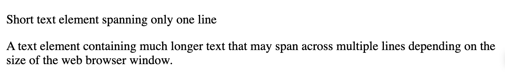
Figure 1. Web browser representation of HTML code showing two paragraphs of text. The first paragraph is very short. The second paragraph is a bit longer and wraps into a second line.
By default, web browsers add spacing before and after `<p>` elements for improved readability. For this reason, `<p>` is called a block element.

### Headings
HTML defines six levels of headings to describe and structure the content of an HTML document. These headings are marked by the HTML tags `<h1>`, `<h2>`, `<h3>`, `<h4>`, `<h5>` and `<h6>`.

```
<h1>Heading level 1 to uniquely identify the page</h1>
<h2>Heading level 2</h2>
<h3>Heading level 3</h3>
<h4>Heading level 4</h4>
<h5>Heading level 5</h5>
<h6>Heading level 6</h6>
```
A web browser renders this HTML code as shown in Figure 2.


Figure 2. Web browser representation of HTML code showing different levels of headings in an HTML document. The hierarchy of headings is indicated through the size of the text.

If you are familiar with word processors such as LibreOffice or Microsoft Word, you may notice some similarities in how an HTML document uses different levels of headings and how they are rendered in the web browser. By default, HTML uses size to indicate the hierarchy and importance of headings and adds space before and after every heading to visually separate it from content.

A heading using the element `<h1>` is at the top of the hierarchy and thus is considered the most important heading that identifies the content of the page. It’s comparable to the `<title>` element discussed in the previous lesson, but within the content of the HTML document. Subsequent heading elements can be used to further structure the content. Make sure not to skip heading levels in between. The document hierarchy should begin with `<h1>`, continue with `<h2>`, then `<h3>` and so on. You don’t need to use every heading element down to `<h6>` if your content does not demand it.

```
Note
Headings are important tools to structure an HTML document, both semantically and visually. However, headings should never be used to increase the size of otherwise structurally unimportant text. By the same principle, one should not make a short paragraph bold or italic to make it look like a heading; use heading tags to mark headings.
```

Let’s begin creating the shopping list HTML document by defining its outline. We will create an `<h1>` element to contain the page title, in this case `Garden Party`, followed by short information wrapped in a `<p>` element. Additionally, we use two `<h2>` elements to introduce the two content sections `Agenda` and `Please bring`.

```
<h1>Garden Party</h1>
<p>Invitation to John's garden party on Saturday next week.</p>
<h2>Agenda</h2>
<h2>Please bring</h2>
```


Opened in a web browser, this HTML code produces the result shown in Figure 3.

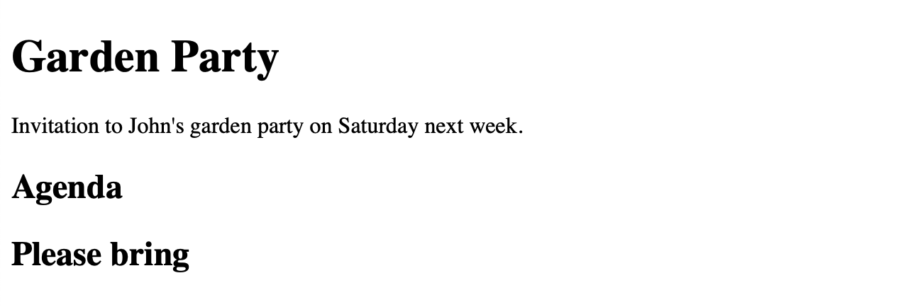

Figure 3. Web browser representation of HTML code showing a simple example document describing an invitation to a garden party, with two headings for agenda and list of things to bring.

### Line Breaks
Sometimes it may be necessary to cause a line break without inserting another `<p>` element or any similar block element. In such cases, you can use the self-closing `<br>` element. Note that it should be used only to insert line breaks that belong to the content, as is the case for poems, song lyrics, or addresses. If the content is separated by meaning, it is better to use a `<p>` element instead.

For example, we could split up the text in the information paragraph from our previous example as follows:
```
<p>
  Invitation to John's garden party.<br>
  Saturday, next week.
</p>
```

In a web browser, this HTML code produces the result shown in Figure 4.


Figure 4. Web browser representation of HTML code showing a simple example document with a forced line break.


### Horizontal Lines
The `<hr>` element defines a horizontal line, also called a horizontal rule. By default, it spans the whole width of its parent element. The `<hr>` element can help you define a thematic change in the content or separate the sections of the document. The element is self-closing and therefore has no closing tag.

For our example, we could separate the two headings:

```
<h1>Garden Party</h1>
<p>Invitation to John's garden party on Saturday next week.</p>
<h2>Agenda</h2>
<hr>
<h2>Please bring</h2>
```

Figure 5 shows the result of this code.

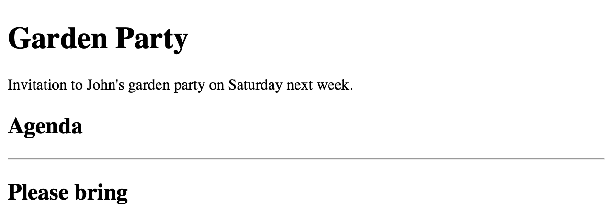

Figure 5. Web browser representation a simple example document describing a shopping list with two sections separated by a horizontal line.

### HTML Lists
In HTML, you can define three types of lists:

Ordered lists
- where the order of the list elements matters

Unordered lists
- where the order of the list elements is not particularly important

Description lists
- to more closely describe some terms

Each contains any number of list items. We’ll describe each type of list.

### Ordered Lists
An ordered list in HTML, denoted using the HTML element `<ol>`, is a collection of any number of list items. What makes this element special is that the order of its list elements is relevant. To emphasize this, web browsers display numerals before the child list items by default.

```
Note
<li> elements are the only valid child elements within an <ol> element.
```

For our example, we can fill in the agenda for the garden party using an `<ol>` element with the following code:

```
<h2>Agenda</h2>
<ol>
  <li>Welcome</li>
  <li>Barbecue</li>
  <li>Dessert</li>
  <li>Fireworks</li>
</ol>
```

In a web browser, this HTML code produces the result shown in Figure 6.

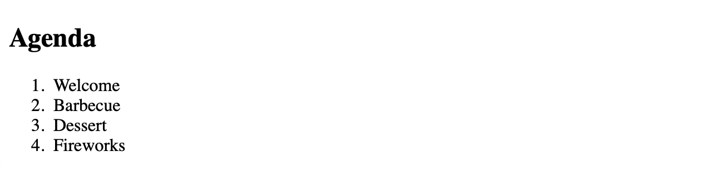

Figure 6. Web browser representation of a simple example document containing a second-level heading followed by an ordered list with four items describing the agenda for a garden party.

#### Options

As you can see in this example, the list items are numbered with decimal numerals beginning at 1 by default. However, you can change this behavior by specifying the `type` attribute of the `<ol>` tag. Valid values for this attribute are `1` for decimal numerals, `A` for uppercase letters, `a` for lowercase letters, `I` for Roman uppercase numerals, and `i` for Roman lowercase numerals.

If you want, you can also define the starting value by using the `start` attribute of the `<ol>` tag. The `start` attribute always takes a decimal numerical value, even if the type attribute sets a different `type` of numbering.

For example, we could adjust the ordered list from the previous example so that the list items will be prefixed with capital letters, beginning with the letter C, as shown in the following example:

```
<h2>Agenda</h2>
<ol type="A" start="3">
  <li>Welcome</li>
  <li>Barbecue</li>
  <li>Dessert</li>
  <li>Fireworks</li>
</ol>
```

Within a web browser, this HTML code is rendered like Figure 7.

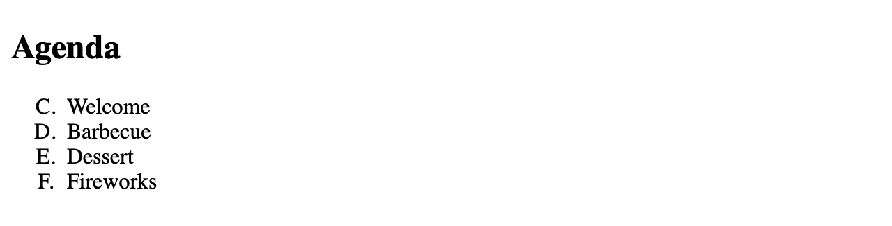

Figure 7. Web browser representation a simple example document containing a second-level heading followed by an ordered list with list items that are prefixed by capital letters beginning with the letter C.
The order of the list items can also be reversed using the `reversed` attribute without a value.

```
Note
In an ordered list, you can also set the initial value of a specific list item using the value attribute of the <li> tag. List items that follow will increment from that number. The value attribute always takes a decimal numerical value.
```

### Unordered Lists
An unordered list contains a series of list items that, unlike those in an ordered list, do not have a special order or sequence. The HTML element for this list is `<ul>`. Once again, `<li>` is the HTML element to mark its list items.

```
Note
<li> elements are the only valid child elements within a <ul> element.
```

For our example web site, we can use the unordered list to list items for guests to bring to the party. We can achieve this with the following HTML code:
```
<h2>Please bring</h2>
<ul>
  <li>Salad</li>
  <li>Drinks</li>
  <li>Bread</li>
  <li>Snacks</li>
  <li>Desserts</li>
</ul>
```

Within a web browser, this HTML code produces the display shown in Figure 8.

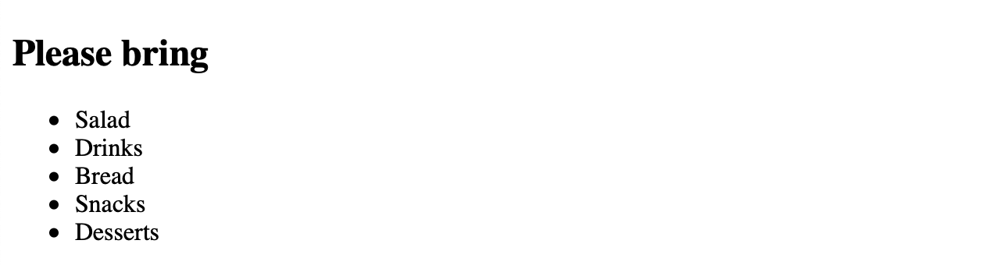

Figure 8. Web browser representation of a simple document containing a second-level heading followed by an unordered list with list items regarding foodstuffs that guests are asked to bring to the garden party.
By default, each list item is represented using a disc bullet. You may change its appearance using CSS, which will be discussed in later lessons.

#### Nesting Lists
Lists can be nested within other lists, such as ordered lists within unordered lists and vice versa. To achieve this, the nested list must be part of a list element `<li>`, because `<li>` is the only valid child element of unordered and ordered lists. When nesting, be careful not to overlap the HTML tags.

For our example, we could add some information of the agenda we created before, as shown in the following example:

```
<h2>Agenda</h2>
<ol type="A" start="3">
  <li>Welcome</li>
  <li>
    Barbecue
    <ul>
      <li>Vegetables</li>
      <li>Meat</li>
      <li>Burgers, including vegetarian options</li>
    </ul>
  </li>
  <li>Dessert</li>
  <li>Fireworks</li>
</ol>
```

A web browser renders the code as shown in Figure 9.

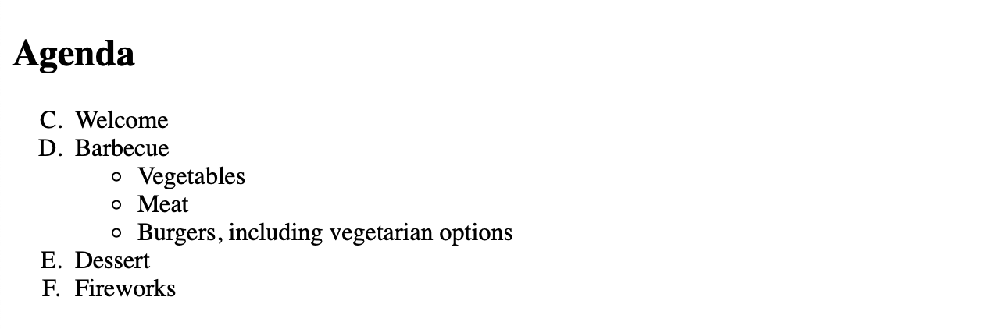

Figure 9. Web browser representation of HTML code showing an unordered lists nested within an ordered list, to represent the agenda for a garden party.

You could go even further and nest multiple levels deep. Theoretically, there is no limit to how many lists you can nest. When doing this however, consider readability for your vistors.

### Description Lists

A description list is defined using the `<dl>` element and represents a dictionary of keys and values. The key is a term or name that you want to describe, and the value is the description. Description lists can range from simple key-value pairs to extensive definitions.

A key (or term) is defined using the `<dt>` element, while its description is defined using the `<dd>` element.

An example for such a description list could be a list of exotic fruits that explains what they look like.

```
<h3>Exotic Fruits</h3>
<dl>
  <dt>Banana</dt>
  <dd>
    A long, curved fruit that is yellow-skinned when ripe. The fruit's skin
    may also have a soft green color when underripe and get brown spots when
    overripe.
  </dd>

  <dt>Kiwi</dt>
  <dd>
    A small, oval fruit with green flesh, black seeds, and a brown, hairy
    skin.
  </dd>

  <dt>Mango</dt>
  <dd>
    A fruit larger than a fist, with a green skin, orange flesh, and one big
    seed. The skin may have spots ranging from green to yellow or red.
  </dd>
</dl>
```

In a web browser, this produces the result shown in Figure 10.

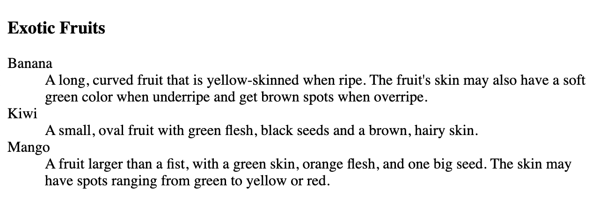

Figure 10. An example of an HTML description list using exotic fruits. The list describes the appearance of three different exotic fruits.

```
Note
As opposed to ordered lists and unordered lists, in a description list, any HTML element is valid as a direct child. This allows you to group elements and style them elsewhere using CSS.
```

### Inline Text Formatting
In HTML, you can use formatting elements to change the appearance of the text. These elements can be categorized as presentation elements or phrase elements.

### Presentation Elements
Basic presentation elements change the font or look of text; these are `<b>`, `<i>`, `<u>` and `<tt>`. These elements were originally defined before CSS let make text bold, italic, etc. There are now usually better ways to alter the look of text, but you still see these elements sometimes.

#### Bold Text
To make text bold, you can wrap it within the `<b>` element as illustrated in the following example. The result appears in Figure 11.
```
This <b>word</b> is bold.
```
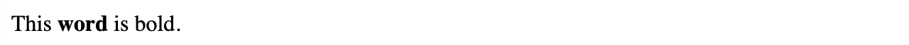

Figure 11. The `<b>` tag is used to make text bold.
According to the HTML5 specification, the `<b>` element should be used only when there are no more appropriate tags. The element that produces the same visual output, but additionally adds semantic importance to the marked text, is `<strong>`.

#### Italic Text

To italicize text, you can wrap it within the `<i>` element as illustrated in the following example. The result appears in Figure 12.

```
This <i>word</i> is in italics.
```


Figure 12. The `<i>` tag is used to italicize text.
According to the HTML 5 specification, the `<i>` element should be used only when there are no more appropriate tags.

#### Underlined Text
To underline text, you can wrap it within the `<u>` element as illustrated in the following example. The result appears in Figure 13.
```
This <u>word</u> is underlined.
```

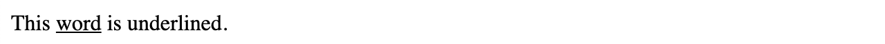

Figure 13. The `<u>` tag is used to underline text.
According to the HTML 5 specification, the `<u>` element should be used only when there are no better ways to underline text. CSS provides a modern alternative.

#### Fixed-Width or Monospaced Font
To display text in a monospaced (fixed-width) font, often used to display computer code, you can use the `<tt>` element as illustrated in the following example. The result appears in Figure 14.

```
This <tt>word</tt> is in fixed-width font.
```
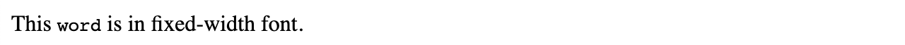

Figure 14. The `<tt>` tag is used to display text in a fixed-width font.
The `<tt>` tag is not supported in HTML5. Web browsers still render it as expected. However, you should use more appropriate tags, which include `<code>`, `<kbd>`, `<var>`, and `<samp>`.

### Phrase Elements
Phrase elements not only change the appearance of text, but also add semantic importance to a word or phrase. Using them, you can emphasize a word or mark it as important. These elements, as opposed to presentation elements, are recognized by screen readers, which makes the text more accessible to visually impaired visitors and allows search engines to better read and evaluate the page content. The phrase elements we use throughout this lesson are `<em>`, `<strong>`, and `<code>`.

### Emphasized Text
To emphasize text, you can wrap it within the `<em>` element as illustrated in the following example:

```
This <em>word</em> is emphasized.
```

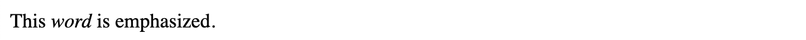

Figure 15. The `<em>` tag is used to emphasize text.
As you can see, web browsers display `<em>` in the same way as `<i>`, but `<em>` adds semantic importance as a phrase element, which improves accessibility for visually impaired visitors.

#### Strong Text
To mark text as important, you can wrap it within the `<strong>` element as illustrated in the following example. The result appears in Figure 16.

```
This <strong>word</strong> is important.
```

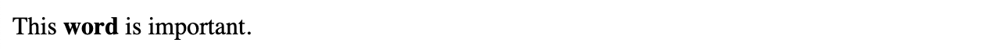

Figure 16. The `<strong>` tag is used to mark text as important.
As you can see, web browsers display `<strong>` in the same way as `<b>`, but `<strong>` adds semantic importance as a phrase element, which improves accessibility for visually impaired visitors.

### Computer Code
To insert a piece of computer code, you can wrap it within the `<code>` element as illustrated in the following example. The result appears in Figure 17.

```
The Markdown code <code># Heading</code> creates a heading at the highest level in the hierarchy.
```


Figure 17. The `<code>` tag is used to insert a piece of computer code.

#### Marked Text

To highlight text with a yellow background, similar to the style of a highlighter, you can use the `<mark>` element as illustrated in the following example. The result appears in Figure 18.

```
This <mark>word</mark> is highlighted.
```

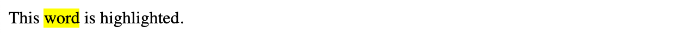

Figure 18. The `<mark>` tag is used to highlight text with a yellow background.

### Formatting the Text of our HTML Shopping List

Drawing on our previous examples, let’s insert some phrase elements to change the appearance of the text while also adding semantic importance. The result appears in Figure 19.

```
<h1>Garden Party</h1>
<p>
  Invitation to <strong>John's garden party</strong>.<br>
  <strong>Saturday, next week.</strong>
</p>

<h2>Agenda</h2>
<ol>
  <li>Welcome</li>
  <li>
    Barbecue
    <ul>
      <li><em>Vegetables</em></li>
      <li><em>Meat</em></li>
      <li><em>Burgers</em>, including vegetarian options</li>
    </ul>
  </li>
  <li>Dessert</li>
  <li><mark>Fireworks</mark></li>
</ol>

<hr>

<h2>Please bring</h2>
<ul>
  <li>Salad</li>
  <li>Drinks</li>
  <li>Bread</li>
  <li>Snacks</li>
  <li>Desserts</li>
</ul>
```

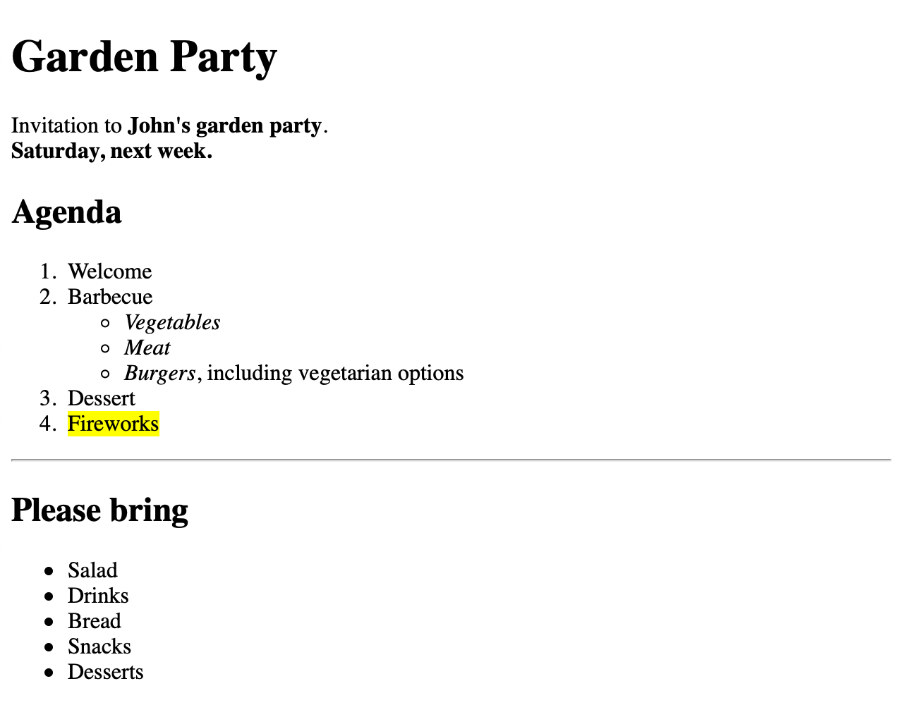

Figure 19. The HTML page with some formatting elements.
In this sample HTML document, the most important information regarding the garden party itself is marked as important using the `<strong>` element. Foods that are available for the barbecue are emphasized using the `<em>` element. The fireworks are simply highlighted using the `<mark>` element.

As an exercise, you can try formatting other pieces of text using the other formatting elements as well.

### Preformatted Text

In most HTML elements, white space is usually reduced to a single space or even ignored entirely. However, there is an HTML element named `<pre>` that lets you define so-called preformatted text. White space in the content of this element, including spaces and line breaks, is preserved and rendered in the web browser. Additionally, the text is displayed in a fixed-width font, similar to the `<code>` element.

```
<pre>
field() {
  shift $1 ; echo $1
}
</pre>
```

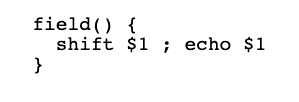

Figure 20. Web browser representation of HTML code illustrating how the `<pre>` HTML element preserves white space.

### Grouping Elements

By convention, HTML elements are divided into two categories:

Block-Level Elements
- These appear on a new line and take up the entire available width. Examples of block-level elements that we already discussed are `<p>`, `<ol>`, and `<h2>`.

Inline-Level Elements
- These appear in the same line as other elements and text, taking up only as much space as their content requires. Examples of inline-level elements are `<strong>`, `<em>`, and `<i>`.

```
Note
HTML5 has introduced more accurate and precise element categories, trying to avoid confusion with CSS block and inline boxes. For simplicity, we will stick here to the conventional subdivision into block and inline elements.
```

The fundamental elements for grouping multiple elements together are the `<div>` and `<span>` elements.

The `<div>` element is a block-level container for other HTML elements and does not add semantic value by itself. You can use this element to divide an HTML document into sections and structure your content, both for code readability and to apply CSS styles to a group of elements, as you will learn in a later lesson.

By default, web browsers always insert a line break before and after each `<div>` element so that each is displayed on its own line.

In contrast, the `<span>` element is used as a container for HTML text and is generally used to group other inline elements in order to apply styles using CSS to a smaller portion of text.

The `<span>` element behaves just like regular text and does not start on a new line. It is therefore an inline element.

The following example compares the visual representation of the semantic `<p>` element and the grouping elements `<div>` and `<span>`:

```
<p>Text within a paragraph</p>
<p>Another paragraph of text</p>
<hr>
<div>Text wrapped within a <code>div</code> element</div>
<div>Another <code>div</code> element with more text</div>
<hr>
<span>Span content</span>
<span>and more span content</span>
```

A web browser renders this code as shown in Figure 21.

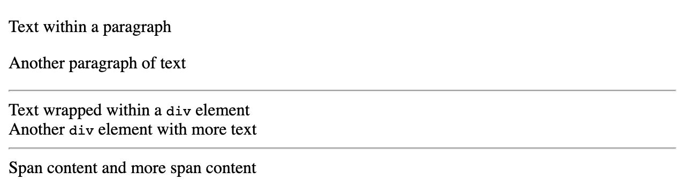

Figure 21. Web browser representation of a test document illustrating the differences between paragraph, div and span elements in HTML.

We already saw that by default, the web browser adds spacing before and after `<p>` elements. This spacing is not applied to either of the grouping elements `<div>` and `<span>`. However, `<div>` elements are formatted as their own blocks, while the text in `<span>` elements is shown in the same line.

### HTML Page Structure
We have discussed how to use HTML elements to describe the content of a web page semantically–in other words, to convey meaning and context to the text. Another group of elements are designed for the purpose of describing the semantic structure of a web page, an expression or its structure. These elements are block elements, i.e., they visually behave similarly to a `<div>` element. Their purpose is to define the semantic structure of a web page by specifying well-defined areas such as headers, footers and the page’s main content. These elements allow the semantic grouping of content so that it may be understood by a computer as well, including search engines and screen readers.

### The `<header>` Element
The `<header>` element contains introductory information to the surrounding semantic element within an HTML document. A header is different from a heading, but a header often includes a heading element (`<h1>`, …​ , `<h6>`).

In practice, this element is most often used to represent the page header, such as a banner with a logo. It can also be used to introduce the content for any of the following elements: `<body>`, `<section>`, `<article>`, `<nav>`, or `<aside>`.

A document may have multiple `<header>` elements, but a `<header>` element cannot be nested within another `<header>` element. Neither can a `<footer>` element be used within a `<header>`.

For example, to add a page header to our example document, we can do the following:

```
<header>
  <h1>Garden Party</h1>
</header>
```

There will be no visible changes to the HTML document, as `<h1>` (like all other heading elements) is a block-level element with no further visual properties.

### The `<main>` Content Element

The `<main>` element is a container for the central content of a web page. There must be no more than one `<main>` element in an HTML document.

In our example document, all the HTML code we have written so far would be placed inside the `<main>` element.

```
<main>
  <header>
    <h1>Garden Party</h1>
  </header>
  <p>
    Invitation to <strong>John's garden party</strong>.<br>
    <strong>Saturday, next week.</strong>
  </p>

  <h2>Agenda</h2>
  <ol>
    <li>Welcome</li>
    <li>
      Barbecue
      <ul>
        <li><em>Vegetables</em></li>
        <li><em>Meat</em></li>
        <li><em>Burgers</em>, including vegetarian options</li>
      </ul>
    </li>
    <li>Dessert</li>
    <li><mark>Fireworks</mark></li>
  </ol>

  <hr>

  <h2>Please bring</h2>
  <ul>
    <li>Salad</li>
    <li>Drinks</li>
    <li>Bread</li>
    <li>Snacks</li>
    <li>Desserts</li>
  </ul>
</main>
```

Like the `<header>` element, the `<main>` element does not cause any visual changes in our example.

### The `<footer>` Element

The `<footer>` element contains footnotes, for example authorship information, contact information, or related documents, for its surrounding semantic element, e.g. `<section>`, `<nav>`, or `<aside>`. A document can have multiple `<footer>` elements that allow you to better describe semantic elements. However, a `<footer>` element cannot be nested within another `<footer>` element, nor can a `<header>` element be used within a `<footer>`.

For our example, we can add contact information for the host (John) as shown in the following example:

```
<footer>
  <p>John Doe</p>
  <p>john.doe@example.com</p>
</footer>
```

### The `<nav>` Element

The `<nav>` element describes a major navigational unit, such as a menu, that contains a series of hyperlinks.

```
Note
Not all hyperlinks must be wrapped within a `<nav>` element. It’s useful when listing a group of links.
```

Because hyperlinks have not yet been covered, the navigation element will not be included in this lesson’s example.

### The `<aside>` Element

The `<aside>` element is a container for content that is not necessary within the ordering of the main page content, but is usually indirectly related or supplementary. This element is often used for sidebars that display secondary information, such as a glossary.

For our example, we can add address and journey information, which are only indirectly related to the remaining content, using the `<aside>` element.

```
<aside>
  <p>
    10, Main Street<br>
    Newville
  </p>
  <p>Parking spaces available.</p>
</aside>
```

### The `<section>` Element

The `<section>` element defines a logical section in a document that is part of the surrounding semantic element, but would not work as stand-alone content, such as a chapter.

In our example document, we can wrap the content sections for the agenda and bring in list sections as shown in the following example:

```
<section>
  <header>
    <h2>Agenda</h2>
  </header>
  <ol>
    <li>Welcome</li>
    <li>
      Barbecue
      <ul>
        <li><em>Vegetables</em></li>
        <li><em>Meat</em></li>
        <li><em>Burgers</em>, including vegetarian options</li>
      </ul>
    </li>
    <li>Dessert</li>
    <li><mark>Fireworks</mark></li>
  </ol>
</section>

<hr>

<section>
  <header>
    <h2>Please bring</h2>
  </header>
  <ul>
    <li>Salad</li>
    <li>Drinks</li>
    <li>Bread</li>
    <li>Snacks</li>
    <li>Desserts</li>
  </ul>
</section>
```

This example also adds further `<header>` elements within the sections, so that each section is within its own `<header>` element.

### The `<article>` Element
The `<article>` element defines independent and standalone content that makes sense on its own without the rest of the page. Its content is potentially redistributable or reusable in another context. Typical examples or material appropriate for an `<article>` element are a blog posting, a product listing for a shop, and an advertisement for a product. The advertisement could then exist both on its own and within a larger page.

In our example, we can replace the first `<section>` that wraps the agenda with an `<article>` element.

```
<article>
  <header>
    <h2>Agenda</h2>
  </header>
  <ol>
    <li>Welcome</li>
    <li>
      Barbecue
      <ul>
        <li><em>Vegetables</em></li>
        <li><em>Meat</em></li>
        <li><em>Burgers</em>, including vegetarian options</li>
      </ul>
    </li>
    <li>Dessert</li>
    <li><mark>Fireworks</mark></li>
  </ol>
</article>
```

The `<header>` element we added in the previous example may persist here as well, because `<article>` elements may have their own `<header>` elements.

### The Final Example

Combining all previous examples, the final HTML document for our invitation looks as follows:

```
<!DOCTYPE html>
<html lang="en">
  <head>
    <title>Garden Party</title>
  </head>

  <body>
    <main>
      <h1>Garden Party</h1>
      <p>
        Invitation to <strong>John's garden party</strong>.<br>
        <strong>Saturday, next week.</strong>
      </p>

      <article>
        <h2>Agenda</h2>
        <ol>
          <li>Welcome</li>
          <li>
            Barbecue
            <ul>
              <li><em>Vegetables</em></li>
              <li><em>Meat</em></li>
              <li><em>Burgers</em>, including vegetarian options</li>
            </ul>
          </li>
          <li>Dessert</li>
          <li><mark>Fireworks</mark></li>
        </ol>
      </article>

      <hr>

      <section>
        <h2>Please bring</h2>
        <ul>
          <li>Salad</li>
          <li>Drinks</li>
          <li>Bread</li>
          <li>Snacks</li>
          <li>Desserts</li>
        </ul>
      </section>
    </main>

    <aside>
      <p>
        10, Main Street<br>
        Newville
      </p>
      <p>Parking spaces available.</p>
    </aside>

    <footer>
      <p>John Doe</p>
      <p>john.doe@example.com</p>
    </footer>
  </body>
</html>
```

In a web browser, the whole page is rendered as shown in Figure 22.

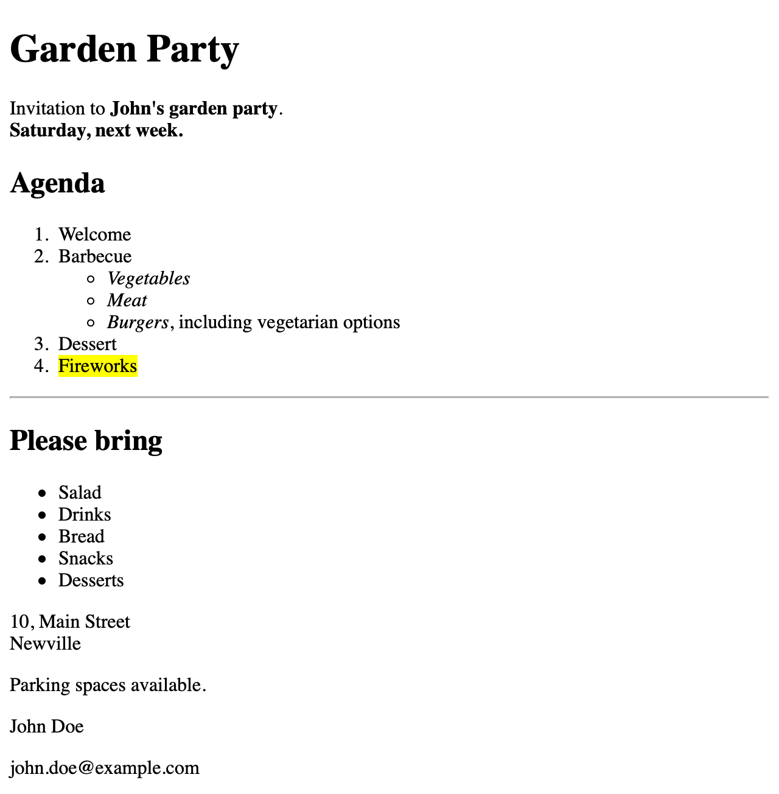

Figure 22. Web browser representation of the resulting HTML document combining the previous examples. The page represents an invitation to a garden party and describes the agenda for the evening and a list of food for the guests to bring.

___

## Lesson 2-3 HTML References and Embedded Resources

Any modern web page is rarely made of just text. It comprises many other types of contents, such as images, audio, video and even other HTML documents. Along with external content, HTML documents can contain links to other documents, which makes the experience of browsing the Internet much simpler.

### Embedded Content
File exchange is possible over the Internet without web pages written in HTML, so why is HTML the chosen format for web documents and not PDF or any other word processing format? One important reason is that HTML keeps its multimedia resources in separate files. In an environment such as the Internet, where information is often redundant and distributed at different locations, it is important to avoid unnecessary data transfers. Most of the time, new versions of a web page pull in the same images and other support files as previous versions, so the web browser can use the previously fetched files instead of copying everything over again. Furthermore, keeping the files separate facilitates the customization of multimedia content according to the client’s characteristics, such as their location, screen size, and connection speed.

### Images
The most common type of embedded content are images that accompany the text. Images are kept separately and are referenced inside the HTML file with the `` tag:

```

```

The `` tag does not require a closing tag. The `src` property indicates the source location for the image file. In this example, the image file `logo.png` must be located in the same directory as the HTML file, otherwise the browser will not be able to display it. The source location property accepts relative paths, so the dot notation can be used to indicate the path to the image:

```

```

The two dots indicate that the image is located inside the parent directory relative to the directory where the HTML file is. If the filename `../logo.png` is used inside an HTML file whose URL is `http://example.com/library/periodicals/index.html`, the browser will request the image file at the address `http://example.com/library/logo.png`.

The dot notation also applies if the HTML file isn’t an actual file in the filesystem; the HTML browser interprets the URL as if it is a path to a file, but it is the HTTP server’s job to decide whether that path refers to a file or to dynamically generated content. The domain and the proper path are automatically added to all requests to the server, in case the HTML file came from a HTTP request. Likewise, the browser will open the proper image if the HTML file was opened directly from the local filesystem.

Source locations beginning with a forward slash `/` are treated as absolute paths. Absolute paths have complete information for the image’s locations, so they work regardless of the HTML document’s location. If the image file is located at another server, which will be the case when a Content Delivery Network (CDN) is used, the domain name must also be included.

```
Note
Content Delivery Networks are composed of geographically distributed servers that store static content for other websites. They help to improve performance and availability for heavy accessed sites.
```

If the image can’t be loaded, the HTML browser will show the text provided by the `alt` attribute instead of the image. For example:

```

```

The `alt` attribute is also important for accessibility. Text-only browsers and screen readers use it as a description for the corresponding image.

#### Image Types

Web browsers can display all the popular image types, such as JPEG, PNG, GIF, and SVG. The dimensions of the images are detected as soon as the images are loaded, but they can be predefined with the `width` and `height` attributes:

```

```

The only reason for including dimension attributes to the `` tag is to avoid breaking the layout when the image takes too long to load or when it can not be loaded at all. Using the `width` and `height` attributes to change the image’s original dimensions may result in undesirable results:

- Images will be distorted when the original size is smaller than the new dimensions or when the new proportion ratio differs from the original.
- Downsizing large images uses extra bandwidth that will result in longer loading timings.

SVG is the only format that doesn’t suffer from these effects, because all of its graphical information is stored in numerical coordinates well suited for scaling and its dimensions don’t affect the file size (hence the name Scalable Vector Graphics). For example, only the position, side dimensions, and color information are necessary to draw a rectangle in SVG. The particular value for every single pixel will be dynamically rendered afterwards. In fact, SVG images are similar to HTML files, in the sense that their graphic elements are also defined by tags in a text file. SVG files are intended for representing sharp-edged drawings, such as charts or diagrams.

Images that don’t fit these criteria should be stored as bitmaps. Unlike vector based image formats, bitmaps store color information for every pixel in the image beforehand. Storing the color value for each pixel in the image generates a very large amount of data, so bitmaps are usually stored in compressed formats, such as JPEG, PNG, or GIF.

The JPEG format is recommended for photographs, because its compression algorithm produces good results for shades and blurry backgrounds. For images where solid colors prevail, the PNG format is more appropriate. Therefore, the PNG format should be chosen when it is necessary to convert a vector image to a bitmap.

The GIF format offers the lowest image quality of all the popular bitmap formats. Nevertheless, it is still widely used because of its support for animations. Indeed, many websites employ GIF files to display short videos, but there are better ways to display video content.

### Audio and Video
Audio and video contents may be added to an HTML document in more of less the same way as images. Unsurprisingly, the tag to add audio is `<audio>` and the tag to add video is `<video>`. Obviously, text-only browsers aren’t able to play multimedia content, so the `<audio>` and `<video>` tags employ the closing tag to hold the text used as a fallback for the element that could not be shown. For example:

```
<audio controls src="/media/recording.mp3">
<p>Unable to play <em>recording.mp3</em></p>
</audio>
```

If the browser doesn’t support the `<audio>` tag, the line “Unable to play recording.mp3” will be shown instead. The use of closing `</audio>` or `</video>` tags allows a web page to include more elaborate alternative content than the simple line of text permitted by the `alt` attribute of the `` tag.

The `src` attribute for `<audio>` and `<video>` tags works in the same way as for the `` tag, but also accepts URLs pointing to a live stream. The browser takes care of buffering, decoding, and displaying the content as it is received. The controls attribute displays playback `controls`. Without it, the visitor will not be able to pause, rewind, or otherwise control the playback.

### Generic Content
An HTML document can be nested into another HTML document, similarly to the insertion of an image into an HTML document, but using the tag `<iframe>`:

```
<iframe name="viewer" src="gallery.html">
<p>Unsupported browser</p>
</iframe>
```

Simpler text-only browsers don’t support the `<iframe>` tag and will display the enclosed text instead. As with the multimedia tags, the `src` attribute sets the source location of the nested document. The `width` and `height` attributes can be added to change the default dimensions of the `iframe` element.

The `name` attribute allows to refer to the iframe and change the nested document. Without this attribute, the nested document cannot be changed. An `anchor` element can be used to load a document from another location inside an iframe instead of the current browser window.

### Links

The page element commonly referred to as a web link is also known by the technical term anchor, hence the use of tag `<a>`. The anchor leads to another location, which can be any address supported by the browser. The location is indicated by the `href` (hyperlink reference) attribute:

```
<a href="contact.html">Contact Information</a>
```

The location can be written as a relative or absolute path, as with the embedded contents discussed earlier. Only the enclosed text content (e.g., `Contact Information`) is visible to the visitor, usually as clickable underlined blue text by default, but the item displayed over the link can also be any other visible content, such as images:

```
<a href="contact.html"></a>
```

Special prefixes can be added to the location to tell the browser how to open it. If the anchor points to an email address, for example, its `href` attribute should include the `mailto`: prefix:

```
<a href="mailto:info@lpi.org">Contact by email</a>
```

The `tel`: prefix indicates a phone number. It’s particularly useful for visitors viewing the page on mobile devices:

```
<a href="tel:+123456789">Contact by phone</a>
```

When the link is clicked, the browser opens the location’s contents with the associated application.

The most common use of anchors is to load other web documents. By default, the browser will replace the current HTML document with content at the new location. This behavior can be modified by using the `target` attribute. The `_blank` target, for example, tells the browser to open the given location in a new window or new browser tab, depending on the visitor’s preferences:

```
<a href="contact.html" target="_blank">Contact Information</a>
```

The `_self` target is the default when the `target` attribute is not provided. It causes the referenced document to replace the current document.

Other types of targets are related to the `<iframe>` element. To load a referenced document inside an `<iframe>` element, the target attribute should point to the name of the iframe element:

```
<p><a href="gallery.html" target="viewer">Photo Gallery</a></p>

<iframe name="viewer" width="800" height="600">
<p>Unsupported browser</p>
</iframe>
```

The iframe element works as a distinct browser window, so any links loaded from the document inside the iframe will replace only the contents of the iframe. To change that behaviour, the anchor elements inside the framed document can also use the `target` attribute. The `_parent` target, when used inside a framed document, will cause the referenced location to replace the parent document containing the `<iframe>` tag. For example, the embedded `gallery.html` document could contain an anchor that loads itself while replacing the parent document:

```
<p><a href="gallery.html" target="_parent">Open as parent document</a></p>
```

HTML documents support multiple levels of nesting with the `<iframe>` tag. The `_top` target, when used in an anchor inside a framed document, will cause the referenced location to replace the main document in the browser window, regardless if it is the immediate parent of the corresponding `<iframe>` or an ancestor further back in the chain.

### Locations Inside Documents
The address of an HTML document may optionally contain a fragment that can be used to identify a resource inside the document. This fragment, also known as the URL anchor, is a string following a hash sign `#` at the end of the URL. For example, the word `History` is the anchor in the URL `https://en.wikipedia.org/wiki/Internet#History`.

When the URL has an anchor, the browser will scroll to the corresponding element in the document: that is, the element whose `id` attribute is equal to the anchor in the URL. In the case of the given URL, `https://en.wikipedia.org/wiki/Internet#History`, the browser will jump straight to the “History” section. Examining the HTML code of the page, we find out that the title of the section has the corresponding id attribute:

```
<span class="mw-headline" id="History">History</span>
```

URL anchors can be used in the `href` attribute of the `<a>` tag, either when they are pointing to external pages or when they are pointing to locations inside the current page. In the latter case, it is enough to put start with just the hash sign with the URL fragment, as in `<a href="#History">History</a>`.

```
Warning
The id attribute must not contain whitespace (spaces, tabs, etc.) and must be unique within the document.
```

There are ways to customize how the browser will react to URL anchors. It is possible, for example, to write a JavaScript function that listens to the hashchange window event and triggers a customized action, such as an animation or an HTTP request. It is worth noting, however, that the URL fragment is never sent to the server with the URL, so it cannot be used as an identifier by the HTTP server.

___

## Lesson 2.4 HTML Forms

Web forms provide a simple and efficient way to request visitor information from an HTML page. The front end developer can use various components such as text fields, checkboxes, buttons, and many others to build interfaces that will send data to the server in a structured way.

### Simple HTML Forms
Before jumping into markup code specific to forms, let us first start with a simple blank HTML document, without any body content:

```
<!DOCTYPE html>
<html lang="en">
<head>
  <meta charset="utf-8">
  <title>Working with HTML Forms</title>
</head>
<body>

<!-- The body content goes here -->

</body>
</html>
```

Save the code sample as a raw text file with a `.html` extension (as in `form.html`) and use your favorite browser to open it. After changing it, press the reload button in the browser to show the modifications.

The basic form structure is given by the <`form`> tag itself and its internal elements:

```
<!DOCTYPE html>
<html lang="en">
<head>
  <meta charset="utf-8">
  <title>Working with HTML Forms</title>
</head>
<body>

<!-- Form to collect personal information -->

<form>

<h2>Personal Information</h2>

<p>Full name:</p>
<p><input type="text" name="fullname" id="fullname"></p>

<p><input type="reset" value="Clear form"></p>
<p><input type="submit" value="Submit form"></p>

</form>

</body>
</html>
```

The double quotes are not required for single word attributes like `type`, so `type=text` works as well as `type="text"`. The developer can choose which convention to use.

Save the new content and reload the page in the browser. You should see the result shown in Figure 1.

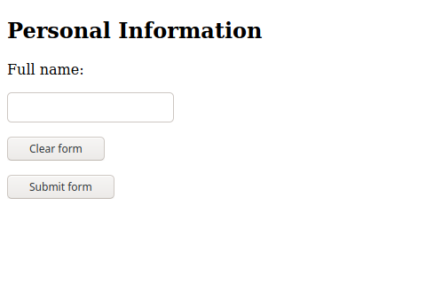

Figure 1. A very basic form.

The `<form>` tag by itself does not produce any noticeable result on the page. The elements inside the `<form>`…`​</form>` tags will define the fields and other visual aids shown to the visitor.

The example code contains both general HTML tags (`<h2>` and `<p>`) and the `<input>` tag, which is a form-specific tag. Whereas general tags can appear anywhere in the document, form-specific tags should be used only within the `<form>` element; that is, between the opening `<form>` and closing `</form>` tags.

```
Note
HTML provides only basic tags and properties to modify the standard appearance of forms. CSS provides elaborate mechanisms to modify the look and feel of the form, so the recommendation is to write HTML code that deals only with the functional aspects of the form and modify its appearance with CSS.
```

As shown in the example, the paragraph tag `<p>` can be used to describe the field to the visitor. However, there is no obvious way the browser could relate the description in the `<p>` tag with the corresponding input element. The `<label>` tag is more appropriate in these cases (from now on, consider all the code samples as being inside the body of the HTML document):

```
<form>

<h2>Personal Information</h2>

<label for="fullname">Full name:</label>
<p><input type="text" name="fullname" id="fullname"></p>

<p><input type="reset" value="Clear form"></p>
<p><input type="submit" value="Submit form"></p>

</form>
```

The `for` attribute in the `<label>` tag contains the id of the corresponding input element. It makes the page more accessible, as screenreaders will be able to speak the contents of the label element when the input element is in focus. Moreover, visitors can click the label to place the focus in its corresponding input field.

The `id` attribute works for form elements like it does for any other element in the document. It provides an identifier for the element that is unique within the entire document. The `name` attribute has a similar purpose, but it is used to identify the input element in the form’s context. The browser uses the `name` attribute to identify the input field when sending the form data to the server, so it is important to use meaningful and unique `name` attributes inside the form.

The `type` attribute is the main attribute of the input element, because it controls the data type the element accepts and its visual presentation to the visitor. If the `type` attribute is not provided, by default the input shows a text box. The following input types are supported by modern browsers:

Table 1. Form input types

Type attribute | Data type | How it is displayed
--- | --- | --- 
hidden | An arbitrary string | N/A
text | Text with no line breaks | A text control
search | Text with no line breaks | A search control
tel | Text with no line breaks | A text control
url | An absolute URL | A text control
email | An email address or list of email addresses | A text control
password | Text with no line breaks (sensitive information) | A text control that obscures data entry
date | A date (year, month, day) with no time zone | A date control
month | A date consisting of a year and a month with no time zone | A month control
week | A date consisting of a week-year number and a week number with no time zone | A week control
time | A time (hour, minute, seconds, fractional seconds) with no time zone | A time control
datetime-local | A date and time (year, month, day, hour, minute, second, fraction of a second) with no time zone | A date and time control
number | A numerical value | A text control or spinner control
range | A numerical value, with the extra semantic that the exact value is not important | A slider control or similar
color | An sRGB color with 8-bit red, green and blue components | A color picker
checkbox | A set of zero or more values from a predefined list |A checkbox (offers choices and allows multiple choices to be selected)
radio | An enumerated value | A radio button (offers choices and allows only one choice to be selected)
file | Zero or more files each with a MIME type and optional file name | A label and a button
submit | An enumerated value, which ends the input process and causes the form to be submitted | A button
image | A coordinate, relative to a particular image’s size, which ends the input process and causes the form to be submitted | Either a clickable image or a button
button | N/A | A generic button
reset | N/A | A button whose function is to reset all other fields to their initial values

The appearance of the `password`, `search`, `tel`, `url`, and `email` input types do not differ from the standard `text` type. Their purpose is to offer hints to the browser about the intended content for that input field, so the browser or the script running on the client side can take custom actions for a specific input type. The only difference between the text input type and the password field type, for example, is that the contents of the password field are not displayed as the visitor types them in. In touch screen devices, where the text is typed with a on-screen keyboard, the browser can pop up only the numerical keyboard when an input of type `tel` gain focus. Another possible action is to suggest a list of known email addresses when an input of type `email` gain focus.

The `number` type also appears as a simple text input, but with increment/decrement arrows at its side. Its use will cause the numerical keyboard to show up in touchscreen devices when it has the focus.

The other input elements have their own appearance and behavior. The `date` type, for example, is rendered according to the local date format settings and a calendar is displayed when the field gains focus:

```
<form>

<p>
  <label for="date">Date:</label>
  <input type="date" name="date" id="date">
</p>

</form>
```

Figure 2 shows how the desktop version of Firefox currently renders this field.

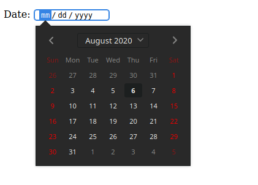

Figure 2. The date input type.

```
Note
For elements may appears slightly different in different browsers or operating systems, but their functioning and usage are always the same.
```

This is a standard feature in all modern browsers and does not require extra options or programming.

Regardless of the input type, the content of an input field is called its value. All field values are empty by default, but the `value` attribute can be used to set a default value for the field. The value for the date type must use the YYYY-MM-DD format. The default value in the following date field in 6 August 2020:

```
<form>

<p>
  <label for="date">Date:</label>
  <input type="date" name="date" id="date" value="2020-08-06">
</p>

</form>
```

The specific input types assist the visitor in filling in the fields, but do not prevent the visitor from bypassing the restrictions and entering arbitrary values in any field. That is why it is important that the field values are validated when they arrive at the server.

Form elements whose values must be typed by the visitor may have special attributes that assist in filling them out. The `placeholder` attribute inserts an example value in the input element:

```
<p>Address: <input type="text" name="address" id="address" placeholder="e.g. 41 John St., Upper Suite 1"></p>
```

The placeholder appears inside the input element, as shown in Figure 3.

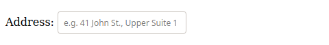

Figure 3. Placeholder attribute example.
Once the visitor starts typing in the field, the placeholder text disappears. The placeholder text is not sent as the field value if the visitor leaves the field empty.

The `required` attribute requires the visitor to fill in a value for the corresponding field before submitting the form:

```
<p>Address: <input type="text" name="address" id="address" required placeholder="e.g. 41 John St., Upper Suite 1"></p>
```

The required attribute is a Boolean attribute, so it can be placed alone (without the equal sign). It is important to mark the fields that are required, otherwise the visitor will not be able to tell which fields are missing and preventing the form submission.

The `autocomplete` attribute indicates whether the value of the input element can be automatically completed by the browser. If set to `autocomplete="off"`, then the browser does not suggest past values to fill the entry. Input elements for sensitive information, such as credit card numbers, should have the `autocomplete` attribute set to `off`.

### Input for large texts: textarea
Unlike the text field, where only one line of text can be inserted, the `textarea` element allows the visitor to enter more than one line of text. The textarea is a separate element, but it is not based on the input element:

```
<p> <label for="comment">Type your comment here:</label> <br>

<textarea id="comment" name="comment" rows="10" cols="50">
My multi-line, plain-text comment.
</textarea>

</p>
```

The typical appearance of a textarea is Figure 4.


Figure 4. The `textarea` element.

Another difference from the input element is that the `textarea` element has a closing tag (`</textarea>`), so its content (i.e. its value) goes in between them. The `rows` and `cols` attribute do not limit the amount of text; they are used only to define the layout. The textarea also has a handle in the bottom-right corner, which allows the visitor to resize it.

### Lists of Options

Several types of form controls can be used to present a list of options to the visitor: the `<select>` element and the `radio` and `checkbox` input types.

The `<select>` element is a dropdown control with a list of predefined entries:

```
<p><label for="browser">Favorite Browser:</label>
<select name="browser" id="browser">
<option value="firefox">Mozilla Firefox</option>
<option value="chrome">Google Chrome</option>
<option value="opera">Opera</option>
<option value="edge">Microsoft Edge</option>
</select>
</p>
```

The `<option>` tag represents a single entry in the corresponding `<select>` control. The entire list appears when the visitor taps or clicks over the control, as shown in Figure 5.

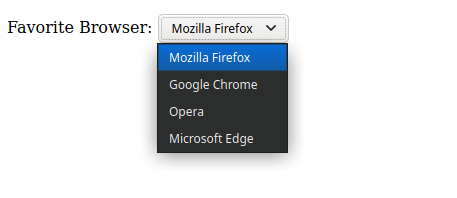

Figure 5. The `select` form element.

The first entry in the list is selected by default. To change this behavior, you can add the `selected` attribute to another entry so it will be selected when the page loads.

The `radio` input type is similar to the `<select>` control, but instead of a dropdown list, it shows all the entries so the visitor can mark one of them. Results of the following code are shown in Figure 6.

```
<p>Favorite Browser:</p>

<p>
	<input type="radio" id="browser-firefox" name="browser" value="firefox" checked>
  <label for="browser-firefox">Mozilla Firefox</label>
</p>

<p>
	<input type="radio" id="browser-chrome" name="browser" value="chrome">
  <label for="browser-chrome">Google Chrome</label>
</p>

<p>
	<input type="radio" id="browser-opera" name="browser" value="opera">
  <label for="browser-opera">Opera</label>
</p>

<p>
	<input type="radio" id="browser-edge" name="browser" value="edge">
  <label for="browser-edge">Microsoft Edge</label>
</p>
```

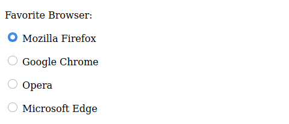

Figure 6. Input elements of type `radio`.

Note that all the `radio` input types in the same group have the same `name` attribute. Each of them is exclusive, so the corresponding `value` attribute for the chosen entry will be the one associated with the shared `name` attribute. The `checked` attribute works like the `selected` attribute of the `<select>` control. It marks the corresponding entry when the page loads for the first time. The `<label>` tag is especially useful for radio entries, because it allows the visitor to check an entry by clicking or tapping on the corresponding text in addition to the control itself.

Whereas `radio` controls are intended for selecting only a single entry of a list, the `checkbox` input type lets the visitor check multiple entries:

```
<p>Favorite Browser:</p>

<p>
	<input type="checkbox" id="browser-firefox" name="browser" value="firefox" checked>
	<label for="browser-firefox">Mozilla Firefox</label>
</p>

<p>
	<input type="checkbox" id="browser-chrome" name="browser" value="chrome" checked>
	<label for="browser-chrome">Google Chrome</label>
</p>

<p>
	<input type="checkbox" id="browser-opera" name="browser" value="opera">
	<label for="browser-opera">Opera</label>
</p>

<p>
	<input type="checkbox" id="browser-edge" name="browser" value="edge">
	<label for="browser-edge">Microsoft Edge</label>
</p>
```

Checkboxes also can use the `checked` attribute to make entries selected by default. Instead of the round controls of the radio input, checkbox are rendered as square controls, as shown in Figure 7.

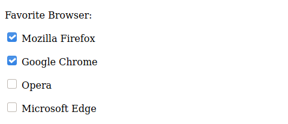

Figure 7. The `checkbox` input type.

If more than one entry is selected, the browser will submit them with the same name, requiring the backend developer to write specific code to properly read form data containing checkboxes.

To improve usability, input fields can be grouped together inside a `<fieldset>` tag:

```
<fieldset>
<legend>Favorite Browser</legend>

<p>
	<input type="checkbox" id="browser-firefox" name="browser" value="firefox" checked>
	<label for="browser-firefox">Mozilla Firefox</label>
</p>

<p>
	<input type="checkbox" id="browser-chrome" name="browser" value="chrome" checked>
	<label for="browser-chrome">Google Chrome</label>
</p>

<p>
	<input type="checkbox" id="browser-opera" name="browser" value="opera">
	<label for="browser-opera">Opera</label>
</p>

<p>
	<input type="checkbox" id="browser-edge" name="browser" value="edge">
	<label for="browser-edge">Microsoft Edge</label>
</p>
</fieldset>
```

The `<legend>` tag contains the text that is placed at the top of the frame the `<fieldset>` tag draws around the controls (Figure 8).

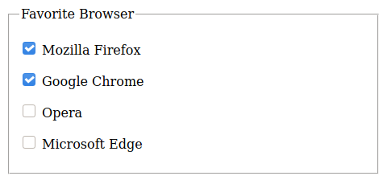

Figure 8. Grouping elements with the `fieldset` tag.

The `<fieldset>` tag does not change how the field values are submitted to the server, but it lets the frontend developer control the nested controls more easily. For example, setting the `disabled` attribute in a `<fieldset>` attribute will make all its inner elements unavailable to the visitor.

### The `hidden` Element Type

There are situations where the developer wants to include information in the form that cannot be manipulated by the visitor, that is, to submit a value chosen by the developer without presenting a form field where the visitor can type or change the value. The developer may want, for example, to include an identification token for that particular form that does not need to be seen by the visitor. A hidden form element is coded as in the following example:

```
<input type="hidden" id="form-token" name="form-token" value="e730a375-b953-4393-847d-2dab065bbc92">
```

The value of a hidden input field is usually added to the document at the server side, when rendering the document. Hidden inputs are treated like ordinary fields when the browser sends them to the server, which also reads them as ordinary input fields.

### The File Input Type
In addition to textual data, either typed or selected from a list, HTML forms can also submit arbitrary files to the server. The `file` input type lets the visitor pick a file from the local file system and send it directly from the web page:

```
<p>
<label for="attachment">Attachment:</label><br>
<input type="file" id="attachment" name="attachment">
</p>
```

Instead of a form field to write in or select a value from, the `file` input type shows a `browse` button that will open a file dialog. Any file type is accepted by the `file` input type, but the backend developer will probably restrict the allowed file types and their maximum size. The file type verification can also be performed in the frontend by adding the `accept` attribute. To accept only JPEG and PNG images, for example, the `accept` attribute should be `accept="image/jpeg, image/png"`.

### Action Buttons
By default, the form is submitted when the visitor presses the Enter key at any input field. To make things more intuitive, a submit button should be added with the `submit` input type:

```
<input type="submit" value="Submit form">
```

The text in the value attribute is displayed on the button, as shown in Figure 9.


Figure 9. A standard submit button.
Another useful button to include in complex forms is the `reset` button, which clears the form and returns it to its original state:

```
<input type="reset" value="Clear form">
```

Like the submit button, the text in the `value` attribute is used to label the button. Alternatively, the `<button>` tag can be used to add buttons to forms or anywhere else in the page. Unlike buttons made with the `<input>` tag, the button element has a closing tag and the button label is their inner content:

```
<button>Submit form</button>
```

When inside a form, the default action for the `button` element is to submit the form. Like the input buttons, the button’s type attribute can be switched to `reset`.

### Form Action and Methods
The last step in writing an HTML form is to define how and to where the data should be sent. These aspects depend on details in both the client and the server.

On the server side, the most common approach is to have a script file that will parse, validate, and process the form data according to the application’s purpose. For example, the backend developer could write a script called `receive_form.php` to receive the data sent from the form. On the client side, the script is indicated in the `action` attribute of the form tag:

```
<form action="receive_form.php">
```

The `action` attribute follows the same conventions as all HTTP addresses. If the script is in the same hierarchy level of the page containing the form, it can be written without its path. Otherwise, the absolute or the relative path must be supplied. The script should also generate the response to serve as a landing page, loaded by the browser after the visitor submits the form.

HTTP provides distinct methods for sending form data through a connection with the server. The most common methods are `get` and `post`, which should be indicated in the `method` attribute of the `form` tag:

```
<form action="receive_form.php" method="get">
```

Or:

```
<form action="receive_form.php" method="post">
```

In the `get` method, the form data is encoded directly in the request URL. When the visitor submits the form, the browser will load the URL defined in the `action` attribute with the form fields appended to it.

The `get` method is preferred for small amounts of data, such as simple contact forms. However, the URL cannot exceed a few thousands characters, so the `post` method should be used when forms contain large or non-textual fields, like images.

The `post` method makes the browser send the form data in the body section of the HTTP request. While necessary for binary data that exceeds the size limit of a URL, the `post` method adds unnecessary overhead to the connection when used in simpler textual forms, so the `get` method is preferred in such cases.

The chosen method does not affect how the visitor interacts with the form. The `get` and `post` methods are processed differently by the server-side script that receives the form.

When using the `post` method, it is also possible to change the MIME type of the form contents with enctype form attribute. This affects how the form fields and values will be stacked together in the HTTP communication with the server. The default value for `enctype` is `application/x-www-form-urlencoded`, which is similar to the format used in the get method. If the form contains input fields of type `file`, the enctype` `multipart/form-data` should be used instead.


___
This documentation is provided by the Linux Professional Institute

[Attribution-NonCommercial-NoDerivatives 4.0 International (CC BY-NC-ND 4.0)](https://creativecommons.org/licenses/by-nc-nd/4.0/)

[Get the Full PDF](https://learning.lpi.org/en/learning-materials/030-100/)