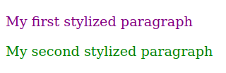
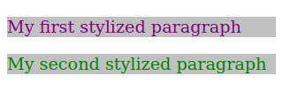
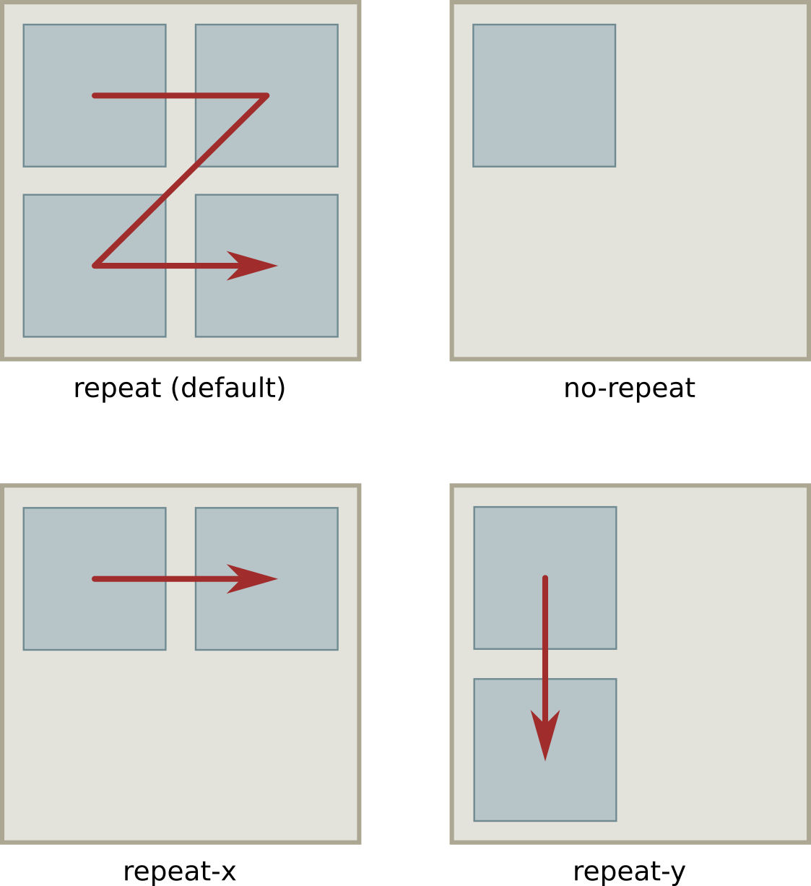
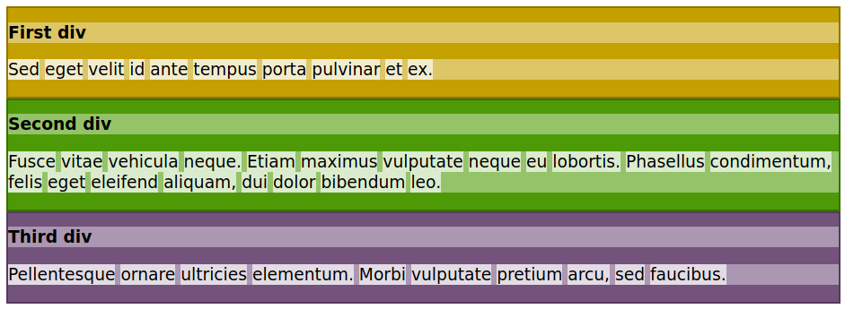
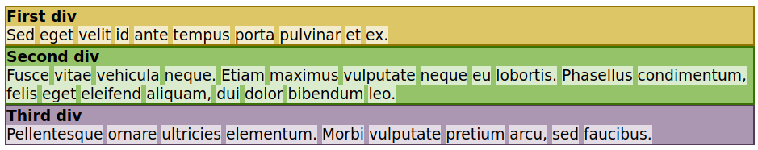
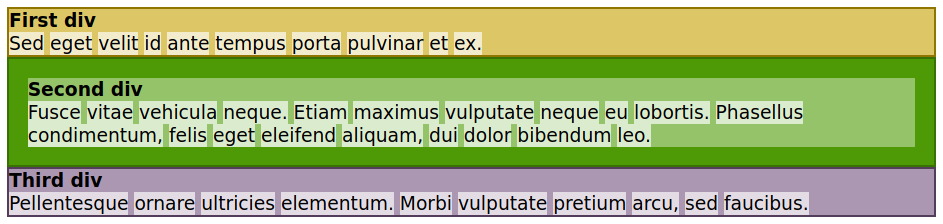
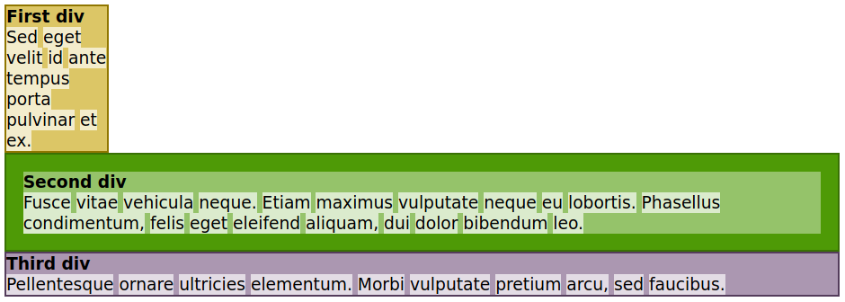
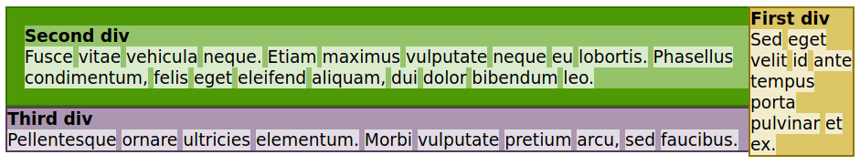
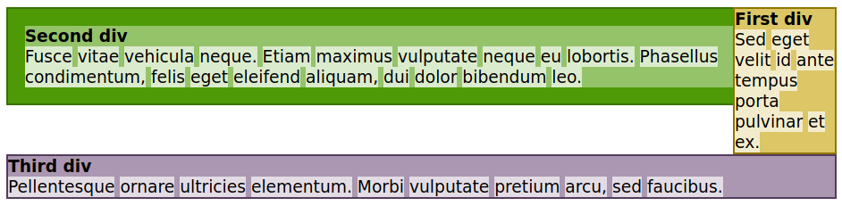

# Web Development Essentials - Topic 3: CSS Content Styling

## Lesson 3.1 CSS Basics

All web browsers render HTML pages using default presentation rules that are practical and straightforward, but not visually appealing. HTML by itself offers few features to write elaborate pages based on modern user experience concepts. After writing simple HTML pages, you have probably realized they are unsightly when compared to well-designed pages found on the Internet. This is because, in modern HTML, the markup code intended for the structure and function of the elements in the document (i.e., the semantic content) is separate from the rules that define how the elements should look (the presentation). The rules for presentation are written in a different language called Cascading Style Sheets (CSS). It lets you change almost all the document’s visual aspects, such as fonts, colors, and the placement of the elements along the page.

HTML documents are not, in most cases, intended to be displayed in a fixed layout like a PDF file. Rather, HTML-based web pages will probably be rendered on a wide variety of screen sizes or even be printed. CSS provides tunable options to ensure that the web page will be rendered as intended, adjusted to the device or application that opens it.

### Applying Styles
There are several ways to including CSS in an HTML document: write it directly in the element’s tag, in a separate section of the page’s source code, or in an external file to be referenced by the HTML page.

### The `style` Attribute
The simplest way to modify the style of a specific element is to write it directly in the element tag using the `style` attribute. All visible HTML elements allow a `style` attribute, whose value may be one or more CSS rules, also known as properties. Let’s start with a simple example, a paragraph element:

```
<p>My stylized paragraph</p>
```

The basic syntax of a customized CSS property is `property: value`, where `property` is the particular aspect you want to change in the element and value defines the replacement for the default option made by the browser. Some properties apply to all elements and some properties apply only to specific elements. Likewise, there are appropriate values to be used in each property.

To change the color of our plain paragraph, for example, we use the `color` property. The `color` property refers to the foreground color, that is, the color of the letters in the paragraph. The color itself goes in the value part of the rule and it can be specified in many different formats, including simple names like `red`, `green`, `blue`, `yellow`, etc. Thus, to make the letter of the paragraph `purple`, add the customized property `color: purple` to the `style` attribute of the element:

```
<p style="color: purple">My first stylized paragraph</p>
```

Other customized properties can go in the same `style` property, but they must be separated by semi-colons. If you want to make the font size larger, for example, add `font-size: larger` to the `style` property:

```
<p style="color: purple; font-size: larger">My first stylized paragraph</p>
```

```
Note
It’s not necessary to add spaces around the colons and semi-colons, but they can make it easier to read the CSS code.
```

To see the result of these changes, save the following HTML in a file and then open it in a web browser (results are shown in Figure 1):

```
<!DOCTYPE html>
<html>
<head>
  <meta charset="utf-8" />
  <title>CSS Basics</title>
</head>
<body>

<p style="color: purple; font-size: larger">My first stylized paragraph</p>

<p style="color: green; font-size: larger">My second stylized paragraph</p>

</body>
</html>
```



Figure 1. A very simple visual change using CSS.

You can imagine every element in the page as a rectangle or a box whose geometric properties and decorations you can manipulate with CSS. The rendering mechanism uses two basic standard concepts for element placement: block placement and inline placement. Block elements occupy all the horizontal space of their parent element and are placed sequentially, from top to bottom. Their height (their vertical dimension, not to be confused with their top position in the page) generally depends on the amount of content they have. Inline elements follow the left-to-right method similar to Western written languages: elements are placed horizontally, from left to right, until there is no more space in the right side, whereupon the element continues on a new line just under the current one. Elements such as `p`, `div`, and `section` are placed as blocks by default, whereas elements such as `span`, `em`, `a`, and single letters are placed inline. These basic placement methods can be fundamentally modified by CSS rules.

The rectangle corresponding to the `p` element in the body of the sample HTML document will be visible if you add the `background-color` property to the rule (Figure 2):

```
<p style="color: purple; font-size: larger; background-color: silver">My first stylized paragraph</p>

<p style="color: green; font-size: larger; background-color: silver">My second stylized paragraph</p>
```



Figure 2. Rectangles corresponding to the paragraphs.

As you add new CSS customized properties to the `style` attribute, you’ll note that the overall code starts to get cluttered. Writing too many CSS rules in the `style` attribute undermines the separation of structure (HTML) and presentation (CSS). Moreover, you’ll soon realize that many styles are shared among different elements and it is not wise to repeat them in every element.

### CSS Rules

Rather than styling the elements directly in their `style` attributes, it is much more practical to tell the browser about the entire collection of elements to which the custom style applies. We do it by adding a selector to the customized properties, matching elements by type, class, unique ID, relative position, etc. The combination of a selector and corresponding customized properties — also known as declarations — is called a CSS rule. The basic syntax of a CSS rule is `selector { property: value }`. As in the `style` attribute, properties separated by semi-colons can be grouped together, as in `p { color: purple; font-size: larger }`. This rule matches every p element in the page and applies the customized `color` and `font-size` properties.

A CSS rule for a parent element will automatically match all its children elements. This means that we could apply the customized properties to all text in the page, regardless of whether it is inside or outside a `<p>` tag, by using the `body` selector instead: `body { color: purple; font-size: larger }`. This strategy frees us from writing the same rule again for all its children, but it may be necessary to write additional rules to “undo” or to modify the inherited rules.

### The `style` Tag

The `<style>` tag lets us write CSS rules inside the HTML page we want to style. It allows the browser to differentiate the CSS code from the HTML code. The `<style>` tag goes in the `head` section of the document:

```
<!DOCTYPE html>
<html>
<head>
  <meta charset="utf-8" />
  <title>CSS Basics</title>

  <style type="text/css">

  p { color: purple; font-size: larger }

  </style>

</head>
<body>

<p>My first stylized paragraph</p>

<p>My second stylized paragraph</p>

</body>
</html>
```

The `type` attribute tells the browser what kind of content is inside the `<style>` tag, i.e. its MIME type. Because every browser that supports CSS assumes that the type of the `<style>` tag is `text/css` by default, including the `type` attribute is optional. There is also a `media` attribute that indicates the media — computer screens or printing, for example — to which the CSS rules in the `<style>` tag apply. By default, the CSS rules apply to any medium where the document is rendered.

As in HTML code, line breaks and code indentation do not change how the CSS rules are interpreted by the browser. Writing:

```
<style type="text/css">

p { color: purple; font-size: larger }

</style>
```

has the exact same result as writing:

```
<style type="text/css">

p {
  color: purple;
  font-size: larger;
}

</style>
```

The extra bytes used by the spaces and line-breaks make little difference in the final size of the document and do not have a significant impact on page’s loading time, so the choice of layout is a matter of taste. Note the semi-colon after the last declaration (`font-size: larger;`) of the CSS rule. That semi-colon is not mandatory, but having it there makes it easier to add another declaration in the next line without worrying about missing semi-colons.

Having the declarations in separate lines also helps when you need to comment out a declaration. Whenever you want to temporarily disable a declaration for troubleshooting reasons, for example, you can enclose the corresponding line with `/*` and `*/`:

```
p {
  color: purple;
  /*
  font-size: larger;
  */
}
```

or:

```
p {
  color: purple;
  /* font-size: larger; */
}
```

Written like this, the `font-size: larger` declaration will be ignored by the browser. Be careful to open and close the comments properly, otherwise the browser may be not able to interpret the rules.

Comments are also useful to write reminders about the rules:

```
/* Texts inside <p> are purple and larger */
p {
  color: purple;
  font-size: larger;
}
```

Reminders like the one in the example are expendable in stylesheets containing a small number of rules, but they are essential to help navigate stylesheets with hundreds (or more) rules.

Even though the `style` attribute and the `<style>` tag are adequate for testing custom styles and useful for specific situations, they are not commonly used. Instead, CSS rules are usually kept in a separate file that can be referenced from the HTML document.

### CSS in External Files
The preferred method to associate CSS definitions with an HTML document is to store the CSS in a separate file. This method offers two main advantages over the previous ones:

- The same styling rules can be shared among distinct documents.
- The CSS file is usually cached by the browser, improving future loading times.

CSS files have the `.css` extension and, like HTML files, they can be edited by any plain text editor. Unlike HTML files, CSS files have no top level structure built with hierarchical tags such as `<head>` or `<body>`. Rather, the CSS file is just a list of rules processed in sequential order by the browser. The same rules written inside a `<style>` tag could instead go in a CSS file.

The association between the HTML document and the CSS rules stored in a file is defined in the HTML document only. To the CSS file, it does not matter whether elements matching its rules exist, so there is no need to enumerate in the CSS file the HTML documents it is linked to. On the HTML side, every linked stylesheet will be applied to the document, just as if the rules were written in a `<style>` tag.

The `<link>` HTML tag defines an external stylesheet to be used in the current document and should go in the head section of the HTML document:

```
<head>
  <meta charset="utf-8" />
  <title>CSS Basics</title>

  <link href="style.css" rel="stylesheet">

</head>
```

Now you can place the rule for the `p` element we used before into the `style.css` file, and the results seen by the visitor to the web page will be the same. If the CSS file is not in the same directory as the HTML document, specify its relative or full path in the `href` attribute. The `<link>` tag can refer to different types of external resources, so it is important to establish what relationship the external resource has with the current document. For external CSS files, the relationship is defined in `rel="stylesheet"`.

The `media` attribute can be used in the same way as for the `<style>` tag: it indicates the media, such as computer screens or printing, to which the rules in the external file should apply.

CSS can completely change an element, but it is still important to use the appropriate element for the components of the page. Otherwise, assistive technologies such as screen-readers may not be able to identify the correct sections of the page.

___

## Lesson 3.2 CSS Selectors and Style Application

When writing a CSS rule, we must tell the browser to which elements the rule applies. We do so by specifying a selector: a pattern that can match an element or group of elements. Selectors come in many different forms, which can be based on the element’s name, its attributes, its relative placement in the document structure, or a combination of these characteristics.

### Page-Wide Styles
One of the advantages of using CSS is that you do not need to write individual rules to elements sharing the same style. An asterisk applies the rule to all elements in the web page, as shown in the following example:

```
* {
  color: purple;
  font-size: large;
}
```

The `*` selector is not the only method to apply a style rule to all elements in the page. A selector that simply matches an element by its tag name is called a type selector, so any HTML tag name such as `body`, `p`, `table`, `em`, etc., can be used as selectors. In CSS, the parent’s style is inherited by its children elements. So, in practice, using the `*` selector has the same effect as applying a rule to the `body` element:

```
body {
  color: purple;
  font-size: large;
}
```

Furthermore, the cascading feature of CSS allows you to fine tune the inherited properties of an element. You can write a general CSS rule that applies to all elements in the page, and then write rules for specific elements or sets of elements.

If the same element matches two or more conflicting rules, the browser applies the rule from the most specific selector. Take the following CSS rules as an example:

```
body {
  color: purple;
  font-size: large;
}

li {
  font-size: small;
}
```

The browser will apply the `color: purple` and `font-size: large` styles to all elements inside the `body` element. However, if there are `li` elements in the page, the browser will replace the `font-size: large` style by the `font-size: small style`, because the `li` selector has a stronger relationship with the `li` element than the `body` selector does.

CSS does not limit the number of equivalent selectors in the same stylesheet, so you can have two or more rules using the same selector:

```
li {
  font-size: small;
}

li {
  font-size: x-small;
}
```

In this case, both rules are equally specific to the `li` element. The browser cannot apply conflicting rules, so it will choose the rule that comes later in the CSS file. To avoid confusion, the recommendation is to group together all properties that use the same selector.

The order in which the rules appear in the stylesheet affect how they are applied in the document, but you can override this behavior by using an `important` rule. If, for any reason, you want to keep the two separate `li` rules, but force the application of the first one instead of the second one, mark the first rule as important:

```
li {
  font-size: small !important;
}

li {
  font-size: x-small;
}
```

Rules marked with `!important` should be used with caution, because they break the natural stylesheet cascading and make it harder to find and correct problems within the CSS file.

### Restrictive Selectors

We saw that we can change certain inherited properties by using selectors matching specific tags. However, we usually need to use distinct styles for elements of the same type.

Attributes of HTML tags can be incorporated into selectors to restrict the set of elements they refer to. Suppose the HTML page you are working on has two types of unordered lists (`<ul>`): one is used at the top of the page as a menu to the sections of the website and the other type is used for conventional lists in the text body:

```
<!DOCTYPE html>
<html>
<head>
  <meta charset="utf-8" />
  <title>CSS Basics</title>
  <link rel="stylesheet" href="style.css">
</head>
<body>

<ul>
  <li><a href="/">Home</a></li>
  <li><a href="/articles">Articles</a></li>
  <li><a href="/about">About</a></li>
</ul>

<div id="content">

<p>The three rocky planets of the solar system are:</p>

<ul>
  <li>Mercury</li>
  <li>Venus</li>
  <li>Earth</li>
  <li>Mars</li>
</ul>

<p>The outer giant planets made most of gas are:</p>

<ul>
  <li>Jupiter</li>
  <li>Saturn</li>
  <li>Uranus</li>
  <li>Neptune</li>
</ul>

</div><!-- #content -->


<div id="footer">

<ul>
  <li><a href="/">Home</a></li>
  <li><a href="/articles">Articles</a></li>
  <li><a href="/about">About</a></li>
</ul>

</div><!-- #footer -->

</body>
</html>
```

By default, each list item has a black circle to its left. You may want to remove the circles from the top menu list while leaving the circles in the other list. However, you cannot simply use the `li` selector because doing so will also remove the circles in the list inside the text body section. You will need a way to tell the browser to modify only the list items used in one list, but not the other.

There are several ways to write selectors matching specific elements in the page. As mentioned earlier, we will first see how to use the elements' attributes to do so. For this example in particular, we can use the `id` attribute to specify the top list only.

The `id` attribute assigns a unique identifier to the corresponding element, which we can use as the selector part of the CSS rule. Before writing the CSS rule, edit the sample HTML file and add `id="topmenu"` to the `ul` element used for the top menu:

```
<ul id="topmenu">
  <li>Home</li>
  <li>Articles</li>
  <li>About</li>
</ul>
```

There is already a `link` element in the `head` section of the HTML document pointing to the `style.css` stylesheet file in the same folder, so we can add the following CSS rules to it:

```
ul#topmenu {
  list-style-type: none
}
```

The hash character is used in a selector, following an element, to designate an ID (without spaces separating them). The tag name to the left of the hash is optional, as there will be no other element with the same ID. Therefore, the selector could be written just as `#topmenu`.

Even though the `list-style-type` property is not a direct property of the `ul` element, CSS properties of the parent element are inherited by its children, so the style assigned to the `ul` element will be inherited by its child `li` elements.

Not all elements have an ID by which they can be selected. Indeed, only a few key layout elements in a page are expected to have IDs. Take the lists of planets used in the sample code, for instance. Although it is possible to assign unique IDs for each individual repeated element like these, this method is not practical for longer pages with lots of contents. Rather, we can use the parent `div` element’s ID as the selector to change the properties of its inner elements.

However, the `div` element is not directly related to HTML lists, so adding the `list-style-type` property to it will have no effect on its children. Thus, to change the black circle in the lists inside the content `div` to a hollow circle, we should use a descendant selector:

```
#topmenu {
  list-style-type: none
}

#content ul {
  list-style-type: circle
}
```

The `#content ul` selector is called a descendant selector because it matches only the `ul` elements that are children of the element whose ID is `content`. We can use as many levels of descendance as necessary. For instance, using `#content ul li` would match only the `li` elements that are descendants of `ul` elements that are descendants of the element whose ID is `content`. But in this example, the longer selector will have the same effect as using `#content ul`, because the `li` elements inherit the CSS properties set to their parent `ul`. Descendant selectors are an essential technique as the page layout grows in complexity.

Let’s say that now you want to change the `font-style` property of the list items in the `topmenu` list and in the list in the footer div to make them look oblique. You can’t simply write a CSS rule using `ul` as the selector, because it will also change the list items in the content div. So far, we have changed CSS properties using one selector at a time, and this method can also be used for this task:

```
#topmenu {
  font-style: oblique
}

#footer ul {
  font-style: oblique
}
```

Separate selectors are not the only way to do it, though. CSS allow us to group together selectors that share one or more styles, using a list of selectors separated by commas:

```
#topmenu, #footer ul {
  font-style: oblique
}
```

Grouping selectors eliminates the extra work of writing duplicate styles. Furthermore, you may want to change the property again in the future and may not remember to change it in all the different places.

### Classes
If you do not want to worry too much about the element hierarchy, you can simply add a `class` to the set of elements you want to customize. Classes are similar to IDs, but instead of identifying only a single element in the page, they can identify a group of elements sharing the same characteristics.

Take the sample HTML page we are working on, for instance. It’s unlikely that in real-world pages we will find structures simple as that, so it would be more practical to select an element using classes only, or a combination of classes and descendancy. To apply the `font-style: oblique` property to the menu lists using classes, first we need to add the class property to the elements in the HTML file. We’ll do it first in the top menu:

```
<ul id="topmenu" class="menu">
  <li><a href="/">Home</a></li>
  <li><a href="/articles">Articles</a></li>
  <li><a href="/about">About</a></li>
</ul>
```

And then in the footer’s menu:

```
<div id="footer">

<ul class="menu">
  <li><a href="/">Home</a></li>
  <li><a href="/articles">Articles</a></li>
  <li><a href="/about">About</a></li>
</ul>

</div><!-- #footer -->
```

With that, we can replace the selector group `#topmenu`, `#footer ul` by the class-based selector `.menu`:

```
.menu {
  font-style: oblique
}
```

As with the ID-based selectors, adding the tag name to the left of the dot in class-based selectors is optional. However, unlike IDs, the same class is supposed to be used in more than one element and they do not even need to be of the same type. Therefore, if the `menu` class is shared among different element types, using the `ul.menu` selector would match only the `ul` elements having the `menu` class. Instead, using `.menu` as the selector will match any element having the `menu` class, regardless of its type.

Furthermore, elements can be associated to more than one class. We could differentiate between the top and the bottom menu by adding an extra class to each one of them:

```
<ul id="topmenu" class="menu top">
```

And in the footer’s menu:

```
<ul class="menu footer">
```

When the `class` attribute has more than one class, they must be separated by spaces. Now, in addition to the CSS rule shared between elements of the `menu` class, we can address the top and footer menu using their corresponding classes:

```
.menu {
  font-style: oblique
}

.menu.top {
  font-size: large
}

.menu.footer {
  font-size: small
}
```

Be aware that writing `.menu.top` differs from `.menu .top` (with a space between the words). The first selector will match elements that have both `menu` and `top` classes, whereas the second will match elements that have the `top` class and a parent element with the `menu` class.

### Special Selectors
CSS selectors can also match dynamic states of elements. These selectors are particularly useful for interactive elements, such as hyperlinks. You may want the appearance of hyperlinks when the mouse pointer moves over them, to draw the visitor’s attention.

Back to our sample page, we could remove the underlines from the links in the top menu and show a line only when the mouse pointer moves over the corresponding link. To do this, we first write a rule to remove the underline from the links in the top menu:

```
.menu.top a {
  text-decoration: none
}
```

Then we use the `:hover` pseudo-class on those same elements to create a CSS rule that will apply only when the mouse pointer is over the corresponding element:

```
.menu.top a:hover {
  text-decoration: underline
}
```

The `:hover` pseudo-class selector accepts all the CSS properties of conventional CSS rules. Other pseudo-classes include `:visited`, which matches hyperlinks that have already been visited, and `:focus`, which matches form elements that have received focus.

___

## Lesson 3.3 CSS Styling

CSS provides hundreds of properties that can be used to modify the appearance of HTML elements. Only experienced designers manage to remember most of them. Nevertheless, it is practical to know the basic properties that are applicable to any element, as well as some element-specific properties. This chapter covers some popular properties you are likely to use.

### CSS Common Properties and Values
Many CSS properties have the same value type. Colors, for example, have the same numerical format whether you are changing the font color or the background color. Similarly, the units available to change the size of the font are also used to change the thickness of a border. However, the format of the value is not always unique. Colors, for example, can be entered in various different formats, as we will see next.

### Colors
Changing the color of an element is probably one of the first things designers learn to do with CSS. You can change the color of the text, the background color, the color of the border of elements, and more.

The value of a color in CSS can be written as a color keyword (i.e. a color name) or as a numerical value listing each color component. All common color names, such as `black`, `white`, `red`, `purple`, `green`, `yellow`, and `blue` are accepted as color keywords. The entire list of color keywords accepted by CSS is available at a W3C web page. But to have finer control over the color, you can use the numerical value.

### Color Keywords
We’ll use the color keyword first, because it’s simpler. The `color` property changes the color of the text in the corresponding element. So to put all the text on the page in purple, you could write the following CSS rule:

```
* {
  color: purple;
}
```

### Numerical Color Values
Although intuitive, color keywords do not offer the complete range of possible colors in modern displays. Web designers usually develop a color palette that employs custom colors, by assigning specific values to the red, green, and blue components.

Each color component is an eight-bit binary number, ranging from 0 to 255. All three components must be specified in the color mixture, and their order is always red, green, blue. Therefore, to change the color for all the text in the page to red using RGB notation, use `rgb(255,0,0)`:

```
* {
  color: rgb(255,0,0);
}
```

A component set to `0` means that the corresponding basic color is not used in the color mixture. Percentages can also be used instead of numbers:

```
* {
  color: rgb(100%,0%,0%);
}
```

The RGB notation is rarely seen if you use a drawing application to create layouts or just to pick its colors. Rather, it is more common to see colors in CSS expressed as hexadecimal values. The color components in hexadecimal also range from 0 to 255, but in a more succinct way, starting with a hash symbol `#` and using a fixed two-digit length for all components. The minimal value `0` is `00` and the maximum value `255` is `FF`, so the color `red` is `#FF0000`.

```
Tip
If the digits in each component of a hexadecimal color repeat, the second digit can be omitted. The color red, for example, can be written with a single digit for each component: #F00.
```

The following list shows the RGB and hexadecimal notation for some basic colors:

Color Keyword |	RGB Notation | Hexadecimal Value
--- | --- | ---
black | rgb(0,0,0) | #000000
white | rgb(255,255,255) | #FFFFFF
red | rgb(255,0,0) | #FF0000
purple | rgb(128,0,128) | #800080
green | rgb(0,128,0) | #008000
yellow | rgb(255,255,0 | #FFFF00
blue | rgb(0,0,255) | #0000FF

Color keywords and the letters in hexadecimal color values are case-insensitive.

### Color Opacity
In addition to opaque colors, it is possible to fill page elements with semi-transparent colors. The opacity of a color can be set using a fourth component in the color value. Unlike the other color components, where the values are integer numbers ranging from 0 to 255, the opacity is a fraction ranging from `0` to `1`.

The lowest value, `0`, results in a completely transparent color, making it undistinguishable from any other fully transparent color. The highest value, `1`, results in a fully opaque color, which is the same as the original color with no transparency at all.

When you use the RGB notation, specify colors with an opacity component through the `rgba` prefix instead of `rgb`. Thus, to make the color red half-transparent, use `rgba(255,0,0,0.5)`. The `a` character stands for alpha channel, a term commonly used to specify the opacity component in digital graphics jargon.

The opacity can also be set in the hexadecimal notation. Here, like the other color components, the opacity ranges from `00` to `FF`. Therefore, to make the color `red` half-transparent using hexadecimal notation, use `#FF000080`.

### Background
The background color of single elements or of the entire page is set with the `background-color` property. It takes the same values as the `color` property, either as keywords or using the RGB/hexadecimal notation.

The background of HTML elements is not restricted to colors, though. With the `background-image` property it is possible to use an image as the background. The accepted image formats are all the conventional ones accepted by the browser, such as JPEG and PNG.

The path to the image should be specified using an `url()` designator. If the image you want to use is in the same folder as the HTML file, it is enough to use only its filename:

```
body {
  background-image: url("background.jpg");
}
```

In this example, the `background.jpg` image file will be used as the background image for the entire body of the page. By default, the background image is repeated if its size does not cover the entire page, starting from the top-left corner of the area corresponding to the rule’s selector. This behavior can be modified with the `background-repeat` property. If you want the background image to be placed in the element’s area without repeating it, use the `no-repeat` value:

```
body {
  background-image: url("background.jpg");
  background-repeat: no-repeat;
}
```

You can also make the image repeat only in the horizontal direction (`background-repeat: repeat-x`) or only in the vertical direction (`background-repeat: repeat-y`).


Figure 1. Background placement using the `background-repeat` property.

```
Tip
Two or more CSS properties can be combined in a single property, called the background shorthand property. The `background-image` and `background-repeat` properties, for example, can be combined in a single background property with background: no-repeat `url("background.jpg")`.
```

A background image can also be placed in a specific position in the element’s area using the `background-position` property. The five basic positions are `top`, `bottom`, `left`, `right` and `center`, but the `top-left` position of the image can also be adjusted with percents:

```
body {
  background-image: url("background.jpg");
  background-repeat: no-repeat;
  background-position: 30% 10%;
}
```

The percent for each position is relative to the corresponding size of the element. In the example, the background image left side will be at 30% of the body’s width (usually the body is the entire visible document) and the top side of the image will be at 10% of the body’s height.

### Borders
Changing an element’s border is also a common layout customization made with CSS. The border refers to the line forming a rectangle around the element and has three basic properties: `color`, `style` and `width`.

The color of the border, defined with `border-color`, follows the same format we saw for the other color properties.

Borders can be traced in a style other than a solid line. You could, for example, use dashes for the border with the property `border-style: dashed`. The other possible style values are:

`dotted`
- A sequence of rounded dots

`double`
- Two straight lines

`groove`
- A line with a carved appearance

`ridge`
- A line with an extruded appearance

`inset`
- An element that appears embedded

`outset`
- An element that appears embossed

The `border-width` property set the thickness of the border. Its value can be a keyword (`thin`, `medium` or `thick`) or a specific numerical value. If you prefer to use a numerical value, you will also need to specify its corresponding unit. This is described next.

### Unit Values
Sizes and distances in CSS can be defined in various ways. Absolute units are based on a fixed number of screen pixels, so they are not so different from the fixed sizes and dimensions used in printed media. There are also relative units, which are dynamically calculated from some measurement given by the media where the page is being rendered, like the available space or another size written in absolute units.

### Absolute Units
Absolute units are equivalent to their physical counterparts, like centimeters or inches. On conventional computer screens, one inch will be 96 pixels wide. The following absolute units are commonly used:

`in` (inch)
- 1 in is equivalent to 2.54 cm or 96 px.

`cm` (centimeter)
- 1 cm is equivalent to 96 px / 2.54.

`mm` (millimeter)
- 1 mm is equivalent to 1 cm / 10.

`px` (pixel)
- px is equivalent to 1 / 96th of an inch.

`pt` (point)
- 1pt is equivalent to 1 / 72th of an inch.

Keep in mind that the ratio of pixels to inch may vary. In high resolution screens, where pixels are more densely packed, an inch will correspond to more than 96 pixels.

### Relative Units
Relative units vary according to other measurements or to the viewport dimensions. The viewport is the area of the document currently visible in its window. In full screen mode, the viewport corresponds to the device screen. The following relative units are commonly used:

`%`
- Percentage — it is relative to the parent element.

`em`
- The size of the font used in the element.

`rem`
- The size of the font used in the root element.

`vw`
- 1% of the viewport’s width.

`vh`
- 1% of the viewport’s height.

The advantage of using relative units is that you can create layouts that are adjustable by changing only a few key sizes. For example, you can use the `pt` unit to set the font size in the body element and the `rem` unit for the fonts in other elements. Once you change the size of font for the body, all the other font sizes will adjust accordingly. Furthermore, using `vw` and `vh` to set the dimensions of page sections makes them adjustable to screens with different sizes.

### Fonts and Text Properties
Typography, or the study of font types, is a very broad design subject, and CSS typography does not lag behind. However, there are a few basic font properties that will meet the needs of most users learning CSS.

The `font-family` property sets the name of the font to be used. There is no guarantee that the chosen font will be available in the system where the page will be viewed, so this property may have no effect in the document. Although it is possible to make the browser download and use the specified font file, most web designers are happy using a generic font family in their documents.

The three most common generic font families are `serif`, `sans-serif` and `monospace`. Serif is the default font family in most browsers. If you prefer to use sans-serif for the entire page, add the following rule to your stylesheet:

```
* {
  font-family: sans-serif;
}
```

Optionally, you can first set a specific font family name, followed by the generic family name:

```
* {
  font-family: "DejaVu Sans", sans-serif;
}
```

If the device rendering the page has that specific font family, the browser will use it. If not, it will use its default font matching the generic family name. Browsers search for fonts in the order they are specified in the property.

Anyone who has used a word processing application will also be familiar with three other font adjustments: size, weight, and style. These three adjustments have CSS properties counterparts: `font-size`, `font-weight`, and `font-style`.

The `font-size` property accepts keyword sizes such as `xx-small`, `x-small`, `small`, `medium`, `large`, `x-large`, `xx-large`, `xxx-large`. These keywords are relative to the default font size used by the browser. The keywords `larger` and `smaller` change the font size relative to the parent’s element font size. You can also express the font size with numerical values, including the unit after the value, or with percentages.

If you do not want to change the font size, but the distance between lines, use the `line-height` property. A `line-height` of `1` will make the line height the same size of the font of the element, which can make the text lines too close together. Therefore, a value greater than 1 is more appropriate for texts. Like the `font-size` property, other units can be used together with the numerical value.

The `font-weight` sets the thickness of the font with the familiar keywords `normal` or `bold`. The keywords `lighter` and `bolder` change the font weight of the element relative to the font weight of its parent element.

The `font-style` property can be set to `italic` to select the italic version of the current font family. The `oblique` value selects the oblique version of the font. These two options are almost identical, but the italic version of a font is usually a little more narrow than the oblique version. If neither italic nor oblique versions of the font exist, the font will be artificially tilted by the browser.

There are other properties that change the way text is rendered in the document. You can, for example, add an underline to some parts of the text you want to emphasize. First, use a `<span>` tag to delimit the text:

```
<p>CSS is the <span class="under">proper mechanism</span> to style HTML documents.</p>
```

Then you can use the `.under` selector to change the `text-decoration` property:

```
.under {
  text-decoration: underline;
}
```

By default, all `a` (link) elements are underlined. If you want to remove it, use the `none` value for the `text-decoration` of all `a` elements:

```
a {
  text-decoration: none;
}
```

When reviewing content, some authors like to cross out incorrect or outdated parts of the text, so that the reader will know the text has been updated and what has been removed. To do so, use the `line-through` value of the `text-decoration` property:

```
.disregard {
  text-decoration: line-through;
}
```

Again, a `<span>` tag can be used to apply the style:

```
<p>Netscape Navigator <span class="disregard">is</span> was one of the most popular Web browsers.</p>
```

Other decorations may be specific to an element. The circles in bullet point lists can be customized using the `list-style-type` property. To change them to squares, for example, use `list-style-type: square`. To simply remove them, set the value of `list-style-type` to `none`.

___ 

## Lesson 3.4 CSS Box Model and Layout

Each visible element in an HTML document is rendered as a rectangular box. Thus, the term box model descibes the approach CSS takes to modifying the visual properties of the elements. Like boxes of different sizes, HTML elements can be nested inside container elements — usually the `div` element — so they can be segregated in sections.

We can use CSS to modify the position of the boxes, from minor adjustments to drastic changes in the disposition of the elements on the page. Besides the normal flow, the position for each box can be based on the elements around it, either its relationship to its parent container or its relationship to the viewport, which is the area of the page visible to the user. No single mechanism meets all possible layout requirements, so you may require a combination of them.

### Normal Flow
The default way the browser renders the document tree is called normal flow. The rectangles corresponding to the elements are placed more or less in the same order they appear in the document tree, relative to their parent elements. Nevertheless, depending on the element type, the corresponding box may follow distinct positioning rules.

A good way to understand the logic of the normal flow is to make the boxes visible. We can start with a very basic page, having only three separate `div` elements, each one having a paragraph with random text:

```
<!DOCTYPE html>
<html lang="en">
<head>
  <meta charset="utf-8">
  <title>CSS Box Model and Layout</title>
  <link rel="stylesheet" href="style.css">
</head>
<body>

<div id="first">
  <h2>First div</h2>
  <p><span>Sed</span> <span>eget</span> <span>velit</span>
  <span>id</span> <span>ante</span> <span>tempus</span>
  <span>porta</span> <span>pulvinar</span> <span>et</span>
  <span>ex.</span></p>
</div><!-- #first -->

<div id="second">
  <h2>Second div</h2>
  <p><span>Fusce</span> <span>vitae</span> <span>vehicula</span>
  <span>neque.</span> <span>Etiam</span> <span>maximus</span>
  <span>vulputate</span> <span>neque</span> <span>eu</span>
  <span>lobortis.</span> <span>Phasellus</span> <span>condimentum,</span>
  <span>felis</span> <span>eget</span> <span>eleifend</span>
  <span>aliquam,</span> <span>dui</span> <span>dolor</span>
  <span>bibendum</span> <span>leo.</span></p>
</div><!-- #second -->

<div id="third">
  <h2>Third div</h2>
  <p><span>Pellentesque</span> <span>ornare</span> <span>ultricies</span>
  <span>elementum.</span> <span>Morbi</span> <span>vulputate</span>
  <span>pretium</span> <span>arcu,</span> <span>sed</span>
  <span>faucibus.</span></p>
</div><!-- #third -->

</body>
</html>
```

Every word is in a `span` element so we can style the words and see how they are treated as boxes as well. To make the boxes visible, we must edit the stylesheet file `style.css` referenced by the HTML document. The following rules will do what we need:

```
* {
  font-family: sans;
  font-size: 14pt;
}

div {
  border: 2px solid #00000044;
}

#first {
  background-color: #c4a000ff;
}

#second {
  background-color: #4e9a06ff;
}

#third {
  background-color: #5c3566da;
}

h2 {
  background-color: #ffffff66;
}

p {
  background-color: #ffffff66;
}

span {
  background-color: #ffffffaa;
}
```

The result appears in Figure 1.



Figure 1. The basic element flow is from top to bottom and left to right.

Figure 1 shows that each HTML tag has a corresponding box in the layout. The `div`, `h2`, and `p` elements extend to the width of their parent element. For instance, the parent element of the `div` elements is the `body` element, so they extend to the width of the body, while the parent of each h2 and p element is its corresponding `div`. The boxes that extend to the width of their parent element are called block elements. Some of the most common HTML tags rendered as blocks are `h1`, `h2`, `h3`, `p`, `ul`, `ol`, `table`, `li`, `div`, `section`, `form`, and `aside`. Sibling block elements — block elements sharing the same immediate parent element — are stacked inside their parent from top to bottom.

```
Note
Some block elements are not intended to be used as containers for other block elements. It is possible, for example, to insert a block element inside a h1 or p element, but it is not considered best practice. Rather, the designer should use an appropriate tag as a container. Common container tags are div, section, and aside.
```

Besides text itself, elements such as `h1`, `p`, and `li` expect only inline elements as children. Like most Western scripts, inline elements follow the left-to-right flow of text. When there is no remaining room in the right side, the flow of inline elements continues in the next line, just like text. Some common HTML tags treated as inline boxes are `span`, `a`, `em`, `strong`, `img`, `input`, and `label`.

In our sample HTML page, every word inside the paragraphs was surrounded by a `span` tag, so they could be highlighted with a corresponding CSS rule. As shown in the image, each span `element` is placed horizontally, from left to right, until there is no more room in the parent element.

The height of the element depends on its contents, so the browser adjusts the height of a container element to accommodate its nested block elements or lines of inline elements. However, some CSS properties affect a box’s shape, its position, and the placement of its inner elements.

The `margin` and `padding` properties affect all box types. If you do not set these properties explicitly, the browser sets some of them using standard values. As seen in Figure 1, the `h2` and `p` elements were rendered with a gap between them. These gaps are the top and bottom margins the browser adds to these elements by default. We can remove them by modifying the CSS rules for the `h2` and `p` selectors:

```
h2 {
  background-color: #ffffff66;
  margin: 0;
}

p {
  background-color: #ffffff66;
  margin: 0;
}
```

The result appears in Figure 2.



Figure 2. The `margin` property can change or remove margins from elements.
The `body` element also, by default, has a small margin that creates a gap surrounding. This gap can also be removed using the `margin` property.

While the `margin` property defines the gap between the element and its surroundings, the `padding` property of the element defines the internal gap between the container’s limits and its child elements. Consider the `h2` and `p` elements inside each `div` in the sample code, for example. We could use their margin property to create a gap to the borders of the corresponding `div`, but it is simpler to change the `padding` property of the container:

```
#second {
  background-color: #4e9a06ff;
  padding: 1em;
}
```

Only the rule for the second `div` was modified, so the results (Figure 3) show the difference between the second `div` and the other `div` containers.



Figure 3. Different `div` containers can have different paddings.

The `margin` property is a shorthand for four properties controlling the four sides of the box: `margin-top`, `margin-right`, `margin-bottom`, and `margin-left`. When `margin` is assigned a single value, as in the examples so far, all four margins of the box use it. When two values are written, the first defines the top and bottom margins, while the second defines the right and left margins. Using `margin: 1em 2em`, for example, defines a gap of 1 em for the top and bottom margins and a gap of 2 em for the right and left margins. Writing four values sets the margins for the four sides in a clockwise direction, beginning at the top. The different values in the shorthand property are not required to use the same units.

The `padding` property is a shorthand as well, following the same principles as the `margin` property.

In their default behaviour, block elements stretch to fit the available width. But this is not mandatory. The `width` property can set a fixed horizontal size to the box:

```
#first {
  background-color: #c4a000ff;
  width: 6em;
}
```

The addition of `width: 6em` to the CSS rule shrinks the first `div` horizontally, leaving a blank space to its right side (Figure 4).



Figure 4. The `width` property changes the horizontal width of the first `div`.

Instead of leaving the first `div` aligned to the left, we may want to center it. Centering a box is equivalent to setting margins of the same size on both sides, so we can use the margin property to center it. The size of the available space may vary, so we use the `auto` value to the left and right margins:

```
#first {
  background-color: #c4a000ff;
  width: 6em;
  margin: 0 auto;
}
```

The left and right margins are automatically computed by the browser and the box will be centered (Figure 5).


Figure 5. The `margin` property is used to center the first `div`.

As shown, making a block element narrower does not make the remaining space available to the next element. The natural flow is still preserved, as if the narrower element still occupies all the available width.

### Customizing Normal Flow
Normal flow is simple and sequential. CSS also lets you break normal flow and position elements in very specific ways, even overriding the scrolling of the page if you want. We’ll look at several ways to control the positioning of elements in this section.

### Floating Elements
It is possible to make sibling block elements share the same horizontal space. One way to do so is through the `float` property, which removes the element from the normal flow. As its name suggests, the `float` property makes the box float over the block elements coming after, so they will be rendered as if they were under the floated box. To make the first `div` float to the right, add `float: right` to the corresponding CSS rule:

```
#first {
  background-color: #c4a000ff;
  width: 6em;
  float: right;
}
```

The automatic margins are ignored in a floated box, so the `margin` property can be removed. Figure 6 shows the result of the floating the first `div` to the right.



Figure 6. The first `div` is floating and is not part of the normal flow.

By default, all block elements coming after the floated element will go under it. Therefore, given enough height, the floated box will cover all remaining block elements.

Although a floating element goes above other block elements, the inline contents inside the floating element’s container wrap around the floating element. The inspiration for this comes from magazine and newspaper layouts, which often wrap text around an image, for example.

The previous image shows how the first `div` covers the second `div` and part of the `third div`. Assume we want the first `div` to float over the second `div`, but not the third. The solution is to include the `clear` property in the CSS rule corresponding to the third `div`:

```
#third {
  background-color: #5c3566da;
  clear: right;
}
```

Setting the `clear` property to `right` makes the corresponding element skip any previous elements floated to the right, resuming normal flow (Figure 7).



Figure 7. The `clear` property returns to normal flow.
Likewise, if a previous element floated to the left, you can use `clear: left` to resume normal flow. When you have to skip floated elements on both the left and the right, use `clear: both`.

### Positioning Boxes
In normal flow, each box goes after the boxes coming before it in the document tree. The previous sibling elements “push” the elements coming after them, moving them to the right and downwards inside their parent element. The parent element may have its own siblings doing the same thing to it. It is like placing tiles side by side in a wall, beginning at the top.

This method of positioning the boxes is called static, and is the default value for the CSS `position` property. Other than defining margins and padding, there is no way to reposition a static box in the page.

Like the tiles in the wall analogy, static placement is not mandatory. As with tiles, you can place the boxes anywhere you want, even covering other boxes. To do so, assign the `position` property to one of the following values:

`relative`
- The element follows the normal flow of the document, but it can use the `top`, `right`, `bottom`, and `left` properties to set offsets relative to its original static position. The offsets can also be negative. The other elements remain in their original places, as if the relative element is still static.

`absolute`
- The element ignores the normal flow of the other elements and positions itself on the page by the `top`, `right`, `bottom`, and `left` properties. Their values are relative to the document’s body or to a non-static parent container.

`fixed`
- The element ignores the normal flow of the other elements and positions itself by the `top`, `right`, `bottom`, and `left` properties. Their values are relative to the viewport (i.e., the screen area where the document is shown). Fixed elements do not move as the visitor scrolls through the document, but resemble a sticker fixed on the screen.

`sticky`
- The element follows the normal flow of the document. However, instead of going off the viewport when the document scrolls, it will stop at the position set by the `top`, `right`, `bottom`, and `left` properties. If the `top` value is `10px`, for example, the element will stop scrolling under the top part of the viewport when it reaches 10 pixels from the top limit of the viewport. When that happens, the rest of the page continues to scroll, but the sticky element behaves like a fixed element in that position. It will go back to its original position when the document scroll back to its position in the viewport. Sticky elements are commonly used nowadays to create top menus that always be visible.

Positions that can use the `top`, `right`, `bottom`, and `left` properties are not required to use them all. If you set both the `top` and `height` properties of an absolute element, for example, the browser implicitly calculates its `bottom` property (top + height = bottom).

### The `display` Property
If the order given by the normal flow is not an issue in your design, but you want to change how the boxes align themselves in the page, modify the `display` property of the element. The `display` property can even make the element completely disappear from the rendered document, by setting `display: none`. This is useful when you want to show the element later using JavaScript.

The `display` property can also, for example, make a block element behave like an inline element (`display: inline`). Doing so is not considered good practice, though. Better methods exist to place container elements side by side, such as the flexbox model.

The flexbox model was invented to overcome the limitations of floats and to eliminate the inappropriate use of tables to structure the page layout. When you set the `display` property of a container element to `flex` to turn it into a flexbox container, its immediate children will behave more or less like cells in a table row.

```
Tip
If you want even more control over the placement of the elements on the page, take a look at the CSS grid feature. The grid is a powerful system based on rows and columns to create elaborate layouts.
```

To test the flex display, add a new `div` element to the example page and make it the container for the three existing `div` elements:

```
<div id="container">

<div id="first">
  <h2>First div</h2>
  <p><span>Sed</span> <span>eget</span> <span>velit</span>
  <span>id</span> <span>ante</span> <span>tempus</span>
  <span>porta</span> <span>pulvinar</span> <span>et</span>
  <span>ex.</span></p>
</div><!-- #first -->

<div id="second">
  <h2>Second div</h2>
  <p><span>Fusce</span> <span>vitae</span> <span>vehicula</span>
  <span>neque.</span> <span>Etiam</span> <span>maximus</span>
  <span>vulputate</span> <span>neque</span> <span>eu</span>
  <span>lobortis.</span> <span>Phasellus</span> <span>condimentum,</span>
  <span>felis</span> <span>eget</span> <span>eleifend</span>
  <span>aliquam,</span> <span>dui</span> <span>dolor</span>
  <span>bibendum</span> <span>leo.</span></p>
</div><!-- #second -->

<div id="third">
  <h2>Third div</h2>
  <p><span>Pellentesque</span> <span>ornare</span> <span>ultricies</span>
  <span>elementum.</span> <span>Morbi</span> <span>vulputate</span>
  <span>pretium</span> <span>arcu,</span> <span>sed</span>
  <span>faucibus.</span></p>
</div><!-- #third -->


</div><!-- #container -->
```

Add the following CSS rule to the stylesheet to turn the container `div` into a flexbox container:

```
#container {
  display: flex;
}
```

The result is the three inner `div` elements rendered side by side (Figure 8).


Figure 8. The flexbox model creates a grid.

Using the value `inline-flex` instead of `flex` has basically the same result, but makes the children behave more like inline elements.

### Responsive Design
We know that CSS provides properties that adjust the sizes of elements and fonts relative to the available screen area. However, you may want to go further and use a different design for different devices: for example, desktop systems versus devices with screens dimensions under a certain size. This approach is called responsive web design, and CSS provides methods called media queries to make it possible.

In the previous example, we modified the page layout to place the `div` elements side by side in columns. That layout is suitable for larger screens, but it will be too cluttered in smaller screens. To solve this problem, we can add a media query to the stylesheet matching only screens with at least `600px` in width:

```
@media (min-width: 600px){
  #container {
    display: flex;
  }
}
```

The CSS rules inside the `@media` directive will be used only if the criteria in parenthesis is satisfied. In this example, if the viewport width is less than `600px`, the rule will not be applied to the container `div` and its children will be rendered as conventional `div` elements. The browser re-evaluates the media queries every time the viewport dimension changes, so the layout can be changed in real time while resizing the browser window or rotating the smartphone.

___
This documentation is provided by the Linux Professional Institute

[Attribution-NonCommercial-NoDerivatives 4.0 International (CC BY-NC-ND 4.0)](https://creativecommons.org/licenses/by-nc-nd/4.0/)

[Get the Full PDF](https://learning.lpi.org/en/learning-materials/030-100/)